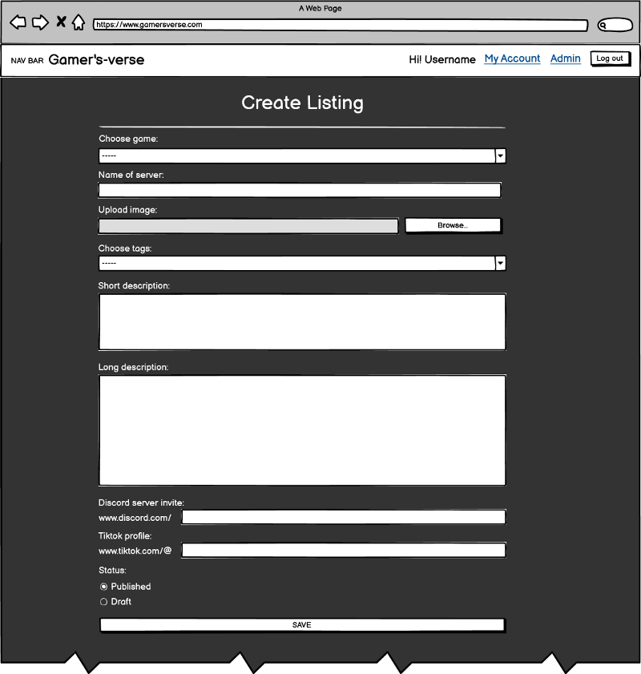
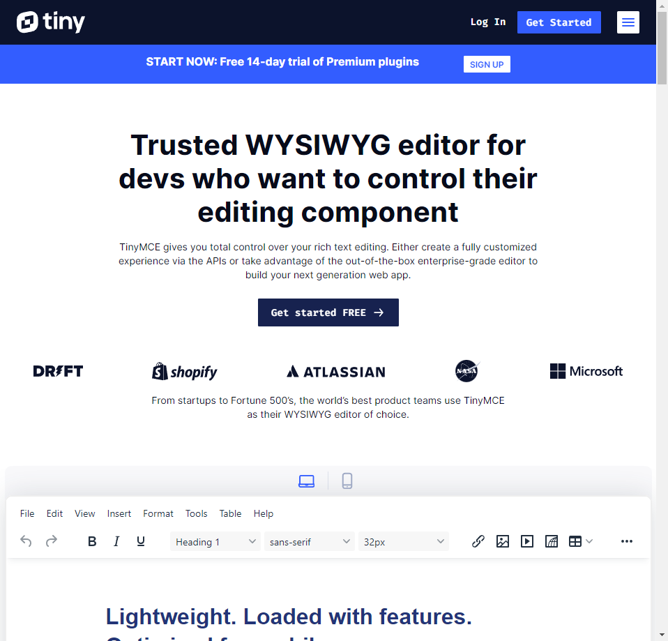

# SERVER DIRECTORY WEBSITE

## Gamer's-verse

## Full stack website

**Built using**:\
Django, Python, JavaScript, BootStrap, CSS and HTML.

**Also including**:\
Cloudinary, Select2 and tinyMCE.


## Live site

[Hosted on Heroku](https://server-directory-website.herokuapp.com/)

## Repository

[GitHub repository](https://github.com/BobWritesCode/server-directory-website)

## Table of Contents

- [Gamer's-verse](#gamers-verse)
  - [Live site](#live-site)
  - [Repository](#repository)
  - [Table of contents](#table-of-contents)
  - [Objective](#objective)
  - [Brief](#brief)
    - [Gamer's-verse - Server directory website](#gamers-verse---server-directory-website)
  - [UX - User Experience Design](#ux---user-experience-design)
    - [Site-visitor](#site-visitor)
    - [Server-owner](#server-owner)
    - [Site-admin](#site-admin)
  - [Development](#development)
    - [Agile design](#agile-design)
      - [GitHub issues](#github-issues)
        - [Issue numbers](#issue-numbers)
        - [User story](#user-story)
        - [Bug report](#bug-report)
        - [Feature request](#feature-request)
        - [Improvement request](#improvement-request)
        - [Assign an assignee or assignees](#choose-assignees)
        - [Apply labels](#choose-labels)
        - [Choose the project](#choose-project)
        - [Choose the milestone](#choose-milestone)
      - [Kanban board](#kanban-board)
    - [Wireframes](#wireframes)
      - [Homepage design](#homepage-design)
      - [Listings design](#listings-design)
      - [Full listing design](#full-listing-design)
      - [My Account design](#my-account-design)
      - [Create listing design](#create-listing-design)
    - [Colour scheme](#colour-scheme)
    - [Typography](#typography)
    - [Imagery](#imagery)
  - [Features](#features)
    - [Existing features](#existing-features)
      - [Navbar](#navbar)
      - [Homepage](#homepage)
      - [Listings page](#listings-page)
        - [Tag strings](#tag-strings)
      - [View listing](#view-listing)
      - [Bumps](#bumps)
      - [User authentication](#user-authentication)
        - [Sign up](#sign-up)
        - [Email verification](#email-verification)
        - [Login](#login)
        - [Forgotten password](#forgotten-password)
      - [My Account](#my-account)
        - [Profile](#profile)
        - [Email update](#email-update)
        - [Password change](#password-change)
        - [Delete account](#delete-account)
        - [Listings](#listings)
          - [Create listing](#create-listing)
          - [Your listings](#your-listings)
            - [Your listings - Management panel](#your-listings---management-panel)
          - [Edit listing](#edit-listing)
          - [Delete listing](#delete-listing)
      - [Admin account page](#admin-account-page)
        - [Image review](#image-review)
        - [Manage users](#manage-users)
          - [User search](#user-search)
          - [User management page](#user-management-page)
            - [Updating user](#updating-user)
            - [Ban/Unban user](#banunban-user)
            - [Send user verification email](#send-user-verification-email)
            - [Assign/Resign as staff](#assignresign-as-staff)
            - [Delete user](#delete-user)
            - [See user's listings](#see-users-listings)
        - [Manage games](#manage-games)
          - [Adding a game](#adding-a-game)
          - [Updating a game](#updating-a-game)
        - [Manage tags](#manage-tags)
          - [Adding a tag](#adding-a-tag)
          - [Updating a tag](#updating-a-tag)
    - [Features left to implement](#features-left-to-implement)
  - [Technologies used](#technologies-used)
    - [Logic](#logic)
      - [Data model](#data-model)
      - [Django](#django)
      - [Python](#python)
        - [Python packages](#python-packages)
          - [DateTime](#datetime)
          - [APScheduler](#apscheduler)
          - [Django Crispy Forms](#django-crispy-forms)
      - [JavaScript](#javascript)
        - [JQuery](#jquery)
      - [CSS](#css)
        - [BootStrap](#bootstrap)
    - [Widgets](#widgets)
      - [Cloudinary](#cloudinary)
      - [Select2](#select2)
      - [tinyMCE](#tinymce)
  - [Testing](#testing)
    - [HTML](#html-testing)
    - [CSS](#css-testing)
    - [JavaScript](#javascript-testing)
    - [Python](#python-testing)
      - [Linters](#python-linters)
      - [Unit testing](#unit-testing)
      - [Coverage](#coverage)
    - [User testing](#user-testing)
  - [Bugs](#bugs)
    - [Unresolved](#unresolved)
    - [Resolved](#resolved)
  - [Deployment](#development)
    - [GitHub - Cloning](#github---cloning)
    - [tinyMCE deployment](#tinymce-deployment)
    - [Cloudinary deployment](#cloudinary-deployment)
    - [ElephantSQL deployment](#elephantsql-deployment)
    - [Heroku](#heroku)
  - [Credits](#credits)
    - [VS Code extensions](#vs-code-extensions)
    - [Other tech](#other-tech)
    - [Content](#content)
    - [Acknowledgements](#acknowledgements)

---

## Objective

Design a Full-Stack site based on business logic used to control a centrally owned dataset. I will need to set up an authentication mechanism and provide role-based access to the site's data or other activities based on the dataset.

**Main technologies that need to be used**:\
HTML, CSS, JavaScript, Python and Django.
Relational database (recommending MySQL or Postgres).

[🔝](#table-of-contents)

---

## Brief

### Gamer's-verse - Server directory website

The goal of this website are:

- to provide a private server directory that users can visit to find a private server based on the game they wish to find that server on.
- for server owners to be able to list their own server to be found by potential players.
- to have a front-end admin access section that allows "staff" to moderate listings. As well as manage users, listings, games, and tags.

[🔝](#table-of-contents)

---

## UX - User experience design

Some example user stories which will affect the design and project functionality.

### Site-visitor

> *"As a site user, there is a easy to navigate homepage so that I can get to the correct part of the website without confusion."*
>
> *"As a new site user, I can sign up so that access member only features like creating a server listing."*
>
> *"As a site-user, I can login so that access my profile and make changes."*
>
> *"As a site-user, I can choose a game from list of games on the homepage so that I can see all the private servers available for that game."*
>
> *"As a site-user, I want the server list to show only servers for the game I selected on the homepage so that I don't get confused with servers appearing from games I did not select."*
>
> *"As a site-user, I can click on a server in the server list so that I can see full details of that server in a new page."*
>
> *"As a site user, I can like a server so that other users can see what servers receive positive feedback."*
>
> *"As a site user, I can filter my search results so that I can narrow down my choices to be more specific."*
>
> *"As a site user, I can filter my search results so that I can narrow down my choices to be more specific."*
>
> *"As a site user, I can search the directory so that I can see a list of servers that may interest me."*
>

### Server-owner

> *"As a server owner I can list my server in the directory so that potential new players will be able to find my server."*
>
> *"As a server owner I can delete my server listening so that it is no longer available to republished."*
>
> *"As a server owner I can update my server listening so that I can make sure that the latest information is available all the time."*
>
> *"As a server owner I can apply tags so that site users can more easily can my server that may interest them."*
>
> *"As a server owner I can upload images for my server profile so that site users can get a better feel for my server."*

### Site-admin

> *"As a site admin I can manually feature a listening so that they get extra awareness."*
>
> *"As a site admin I want to be able to manage the site from a user-friendly admin panel."*

[🔝](#table-of-contents)

---

## Development

### Agile design

- [GitHub Issues](#github-issues)
  - [User Story](#user-story)
  - [Bug Report](#bug-report)
  - [Feature Request](#feature-request)
  - [Improvement Request](#improvement-request)
  - [Assign an assignee or assignees](#choose-assignees)
  - [Apply labels](#choose-labels)
  - [Choose the project](#choose-project)
  - [Choose the milestone](#choose-milestone)
- [Kanban Board](#kanban-board)

When taking on any project especially large and complicated projects with different moving parts, where it's easy to jump from one part of the project to another, leaving the previous part incomplete and leaving room for error. It's best to come up with a strategy. This is where agile design comes in, it can help you identify all the different parts of the project that need to be completed, in which order may be best, and if you are in a team delegate tasks to people so everyone knows what their responsibilities are.

As part of the project, I heavily used GitHub Issues and GitHub Kanban board.

[🔝](#table-of-contents)

#### GitHub issues

- [Issue numbers](#issue-numbers)

I created 4 different templates for issues being raised:

- [User story](#user-story)
- [Bug report](#bug-report)
- [Feature request](#feature-request)
- [Improvement request](#improvement-request)

Each issue category played a part in helping easily identify the category the issue was going to be related to, and each has a different template for myself, and other users to provide useful information that will help resolve the issue.

When an issue is either being created or after. There are a few different options you can modify to help delegate the task and its priority. You can:

- [Assign an assignee or assignees](#choose-assignees)
- [Apply labels](#choose-labels)
- [Choose the project](#choose-project)
- [Choose the milestone](#choose-milestone)

[🔝](#table-of-contents)

##### Issue numbers

Every issue raised will have an issue number i.e., #1, #2, #3 and so on. If you put the issue number in the commit message, then that commit will automatically by GitHub be linked to that issue.

If you use certain keywords as well it will also automatically manage the issue such as 'bug: fixes #58'. This will automatically close that issue for you.

##### User story

[Link to user story template.](https://github.com/BobWritesCode/server-directory-website/blob/master/.github/ISSUE_TEMPLATE/user-story.md)

[Link to user story Issues.](https://github.com/BobWritesCode/server-directory-website/issues?q=is%3Aissue+%5BUser+Story%5D+)

The user story was the first template I created, and this was basically to help start to build the idea of the project and what potential features were going to be needed.

Any user story was also allocated the tag 'enhancement' automatically to help identify this was going to be a new feature.

##### Bug report

[Link to bug report template.](https://github.com/BobWritesCode/server-directory-website/blob/master/.github/ISSUE_TEMPLATE/bug_report.md)

[Link to bug report Issues.](https://github.com/BobWritesCode/server-directory-website/issues?q=is%3Aissue+label%3Abug)

As this is a larger and more complicated project, inevitably bugs came up. Bugs are very easy to get distracted by as they generally were discovered while I was working on an unrelated feature. When a bug came up, I would create a bug report so I could attend to it later.

Any bug report was also allocated the tag 'bug' to help identify this was going to be a new feature. I could also opt to allocate it the tag 'priority' to show it was something that needed to be fixed immediately as it could be either project breaking or may affect many users.

##### Feature request

[Link to feature request template.](https://github.com/BobWritesCode/server-directory-website/blob/master/.github/ISSUE_TEMPLATE/improvement-request.md)

[Link to feature request Issues.](https://github.com/BobWritesCode/server-directory-website/issues?q=is%3Aissue+%5BNew+Feat%5D+)

While building the project new ideas on new features would come to mind. Some that would potentially be perfect for the first version of the project and some that potentially could be implemented later. Whenever a new feature came to mind, I would complete the feature request form.

Any feature request was also allocated the tag 'enhancement' automatically to help identify this was going to be a new feature.

##### Improvement request

[Link to improvement request template.](https://github.com/BobWritesCode/server-directory-website/blob/master/.github/ISSUE_TEMPLATE/improvement-request.md)

[Link to improvement request Issues.](https://github.com/BobWritesCode/server-directory-website/issues?q=is%3Aissue+label%3AImprovement)

Either while using the project as a user or developing the project. I would realise improvements to feature that had already been built. To separate new features to improvements I created the Improvement Request form. Improvements could mainly be left to later in the project as it was important to make sure that all the main features were implemented first.

Any Improvement Request was also allocated the tag 'enhancement' automatically to help identify this was going to be a new feature.

##### Choose assignees

[Link to my assigned issues.](https://github.com/BobWritesCode/server-directory-website/issues?q=is%3Aissue+label%3Aenhancement+assignee%3ABobWritesCode)

It may come as no surprise; I am the only person assigned issues on this project. Potentially in the future if the project grows and the team grows past me, then I would be able to assign other team members to tasks.

##### Choose labels

[Link to label choices for this project.](https://github.com/BobWritesCode/server-directory-website/labels)

When creating an issue from an issue report, a label is automatically allocated but the user or a person looking after the project can choose to assign their own labels. For example, if something needs to be tagged as 'priority'.

##### Choose project

It's probably obvious but all issues were assigned to this project. But one small feature that may go unnoticed you are able to choose which column on the Kanban board that issue goes to. For people who prefer to use the Kanban board to see what issues where.

##### Choose milestone

[Link to milestone for this project.](https://github.com/BobWritesCode/server-directory-website/milestones)

A milestone is essentially a marker in the projects journey i.e., Alpha, Beta, Release v1, v2 and so on... For potentially a large project that is based over a year or on-going you maybe decided to allocate features to different quarters of the year. The milestone option allows you to do that. This essentially prioritises which issues need to be dealt with by when.

In my project I created 3 milestones:

- Launch version 1.00
  - These are issues that 100% must be done ready for version 1.00.
- Non-essential for v.100
  - These are issues that would be nice to have done but are mandatory.
- Post 1.00 to do list
  - These are issues that are mainly going to be features that can wait until version 1.00 has been completed and be implements into a future version.

#### Kanban board

[Link to project Kanban board.](https://github.com/users/BobWritesCode/projects/3)

A Kanban board is an agile project management tool that helps visualize tasks. It helps with the day-to-day works flow as you can easily see which tasks need to be completed. With GitHub projects you can have several views of the Kanban board. As you might want to have one for the team, and maybe views for each team member. Or different labels such as bugs or improvements.

[🔝](#table-of-contents)

---

### Wireframes

Below are some wireframe that I designed to help build and represent the design of the website.

#### Homepage design

<details><summary>PC</summary> <!-- markdownlint-disable-line -->


</details>
<details><summary>Mobile</summary> <!-- markdownlint-disable-line -->


</details>

#### Listings design

<details><summary>PC</summary> <!-- markdownlint-disable-line -->


</details>
<details><summary>Mobile</summary> <!-- markdownlint-disable-line -->


</details>

#### Full listing design

<details><summary>PC</summary> <!-- markdownlint-disable-line -->


</details>
<details><summary>Mobile</summary> <!-- markdownlint-disable-line -->


</details>

#### My Account design

<details><summary>PC</summary> <!-- markdownlint-disable-line -->


</details>
<details><summary>Mobile</summary> <!-- markdownlint-disable-line -->


</details>

#### Create listing design

<details><summary>PC</summary> <!-- markdownlint-disable-line -->


</details>
<details><summary>Mobile</summary> <!-- markdownlint-disable-line -->


</details>

### Colour scheme

The 4 main colour's hex codes for this site are: D63600, F8F9FA, 262626, 151515.\
These 4 colours contrast very nicely against each other, and the white text against the other 3 colours pass WCAG contrast scores.


### Typography

We are using [BootStrap's](#bootstrap) native font stack. As it provides a sharp and clear font that works perfectly with the projects overall styling.

[Link to BootStrap's documentation for Native font stack.](https://getbootstrap.com/docs/5.3/content/reboot/#native-font-stack)

### Imagery

The site currently has no media on it other then what is uploaded by users. Currently this is for game cover images which are covered by 'Fair use'. To make sure that no images that would be offensive or cause complications are being publicly shown on the site, there is the [image review](#image-review) function.

[🔝](#table-of-contents)

---

## Features

### Existing features

#### Navbar

The navbar was design to be simple and vibrant. Early versions the Navbar was off-white, but feedback suggested that it was not completely obvious there was a nav bar as it would tend to merge in with the browser bar if using a PC to access the website.

Depending on if the user is flagged as a staff member will determine if they can see the 'Admin' nav button.

<details><summary>PC</summary> <!-- markdownlint-disable-line -->


</details>

<details><summary>Mobile</summary> <!-- markdownlint-disable-line -->


</details>

```html
<!-- base.html -->
<div class="collapse navbar-collapse" style="flex-grow: unset;" id="navbarTogglerDemo02">
    <ul class="navbar-nav mt-2 mt-lg-0">
        <!-- Here we check to see if the requesting user is logged in -->
        
        <li class="navbar-text text-light">
            <strong>Hi {{ user.username }}!</strong>
        </li>
        <li class="nav-item">
            <a class="nav-link text-light" href="">My Account</a>
        </li>
        <!-- Here we check to see if the requesting user is a staff member -->
        
        <li class="nav-item text-light">
            <a class="nav-link text-light" href="">Admin</a>
        </li>
        
        <li class="nav-item text-light">
            <a class="ms-1 me-3 btn btn-outline-light" href="">Log Out</a>
        </li>
        <!-- If requesting user is not logged in -->
        
        <li class="nav-item">
            <a class="ms-1 nav-link text-light" href="">Login</a>
        </li>
        <li class="nav-item">
            <a class="ms-1 me-3 btn btn-outline-light" href="">Sign Up</a>
        </li>
        
    </ul>
</div>
```

[🔝](#table-of-contents)

#### Homepage

The homepage is designed to be simple and provide a clear understanding of what the website is about when a first-time user visits.

<details><summary>Homepage screenshot</summary> <!-- markdownlint-disable-line -->


</details>

The user can hover their mouse over the different game cards. This help the user understand these are intractable. For UX purpose the whole card was made a clickable link to avoid user confusion on how to proceed.


[🔝](#table-of-contents)

#### Listings page

The listing page allows the user to start looking through the different listings. The user can filter their search down using the tags filter on the right. They can select up to as many tags as they like and easily remove tags. This provides a much more bespoke list that is filled only with that user's interests.

<details><summary>Listings screenshot</summary> <!-- markdownlint-disable-line -->


</details>

##### Tag strings

One challenge I had was that I wanted to create a feature that allowed users to really customise their search by adding and removing tags. I spent a little time on the internet searching through to find the best way to go about this. I even looked at some other sites that I knew that had a filter by tag function. But what I found was that not many people were able to do it, and you could only apply 1 tag at a time.

So, I came up with the below code to create something I call a 'tag string'. Simply what it does is create a URL that that has a long string in it that tells the server which tags to load for the user. Then the tag buttons `href`s will either be prefixed with an 'A' or an 'R' to indicate if this tag is to be added or removed when the user clicks on the button.

In the end it produces exactly what I needed to do, and this code was completely written purely by myself, as I really couldn't find any solutions or help anywhere.

```py
# views.py
# These are snippets from the code to provide the filtering by essentially
# building tag string in the url. I removed other parts of this method not
# to the tag filtering.

def listings_view(request: object, slug: str, tag_string: str = ""):

    # Get only the tags linked to a game.
    game = get_object_or_404(Game, slug=slug)
    tags = game.tags.all()

    # Create and empty list then append all tags into that list.
    all_tags_for_game = []
    for tag in tags:
        all_tags_for_game.append([tag.pk, tag.name])

    # Manage tag_string
    if tag_string != "":
        # Create list from string
        selected_tags = tag_string.split("%")
        # Check to see if adding or removing tag
        action = selected_tags.pop(0)

        # A = add tag, R = remove tag
        if action == "A":
            # Prepare new tag_string to send to front-end
            tag_string = '%' + '%'.join(selected_tags)

        else:
            # Which tag has been selected to be removed
            to_be_removed = selected_tags.pop(0)

            # Remove tag from selected list
            selected_tags.remove(to_be_removed)

            # Check to see if all tags have been unselected
            # Prepare tag_string
            if len(selected_tags) != 0:
                tag_string = '%' + '%'.join(selected_tags)
            else:
                tag_string = ''

        # Narrows server list down based on tags picked by user
        for value in selected_tags:
            listings = listings.filter(tags__name=value)

        # Use list comprehension to remove selected tags from all
        # available tags
        tags = [x for x in game.tags.all() if x.name not in selected_tags]

        tags.sort(key=operator.attrgetter('name'))
        selected_tags.sort()

    else:
        # If tag_string empty then create empty list
        selected_tags = []
        # Get all available tags for game selected
        tags = game.tags.all().order_by('name')

    # Now now longer required to to stay a queryset, convert to list
    # and reorder by bump count.
    listings = sorted(listings.all(), key=lambda a: a.bump_counter(),
                      reverse=True)

    return render(
        request,
        "listings.html",
        {
            "listings": listings,
            "selected_tags": selected_tags,
            "tags": tags,
            "tag_string": tag_string,
            "slug": slug,
        },
    )
```

[🔝](#table-of-contents)

#### View listing

<details><summary>Screenshot</summary> <!-- markdownlint-disable-line -->


</details>

The full listing page provides the user a much more detailed insight about the server listing. It allows the server owner to provide a long description so they can describe as much detail as they want about the server to attract new players.

On this page their is a section just under the tags where a user can interact with, here a user can:

- Bump the listing,
- Find the discord invite link,
- Find the TikTok profile link (if available, if not this button will not be shown).

If the user is a staff member then the staff view panel will also be shown, where a staff user can quickly go to the owner's profile or edit the listing.


[🔝](#table-of-contents)

#### Bumps


Bumps allow user to help promote a listing. Bumping a server will push it to the top of the listings. And like how search engine results work, the higher up the list you are the more views you will get.

To help promote active servers, bumps expire after the duration set by the site owner, currently stored in the `constants.py` file, but later there will be an option to be able to change this in a super admin panel. Making it easier for an end user to update themselves.

A user can only bump up to a specific number of listings at a time and will have to wait until their bump expires. Currently it is set to expire the next date for the purposes of this project demonstration.

A user can only bump a single list once at a time.
Once a user has used up their allocated bumps, they will see a message saying they are out of bumps.
A user must be signed in to bump otherwise they will see a message saying they need to login first.

 

This is what the user Bumps list looks like in their [My Account](#my-account) page.


The way the bumps are automatically expired is by setting an automated task that run at midnight every day or at server restart. The task will query for bumps that are less than or, equal to the current date and delete them. Print messages are produced purely to check there are no issues.

*You can read more about how the automated jobs work by checking out the [APScheduler](#apscheduler) section of this README.*

```py
#jobs.py
def clear_bumps():
    """
    Automated task: Finds expired bumps and deletes them.
    """
    print('clear_bumps(): Starting automated task.')
    # Get bumps that have expired
    # __lte means 'less than or, equal to', this is used oppose to '<='>
    query = Q(expiry__lte=datetime.now())
    queryset = Bumps.objects.filter(query)
    print(f'clear_bumps(): Deleting {len(queryset)} bump(s).')
    # Delete expired bumps
    queryset.delete()
    print('clear_bumps(): Completed automated task.')
```

[🔝](#table-of-contents)

### User authentication

#### Sign Up

<details><summary>Screenshot</summary> <!-- markdownlint-disable-line -->


</details>

It's important that users can easily sign up, the sign-up form itself is designed to be simplistic. Asking for a username, email address, and password. Email and password will be what is required to login, but the username will be used to identify the user to other site users and staff. Both the username and email address must be unique, and the user will be notified if they are not.


```py
# views.py
def sign_up_view(request):
    """
    GET: Loads sign up view
    POST: Attempts to create a new user, unless there is an error
    then displays error to the user.

    Args:
        request (object): GET/POST request from user.

    Returns:
        redirect (function): Email verification view.
        render (function): Loads view.
    """
    if request.method == 'POST':
        form = SignupForm(request.POST)
        # Check user has completed form as required.
        if form.is_valid():
            # Original code before modifications, check ReadMe:
            # https://shafikshaon.medium.com/
            # user-registration-with-email-verification-in-django-8aeff5ce498d
            # Save new user to database.
            try:
                user = form.save()
                send_email_verification(request, user)
                return redirect('signup_verify_email')
            except ValidationError as err:
                for field, errors in err.message_dict.items():
                    form.add_error(field, errors)
    else:
        form = SignupForm()
    return render(request, 'registration/signup.html', {'form': form})
```

[🔝](#table-of-contents)

#### Email verification

Once the user has successfully input their sign-up details, they will be directed to a screen explaining that they have been sent an email to verify their email address.

<details><summary>Screenshot</summary> <!-- markdownlint-disable-line -->


</details>

```py
# views.py
@require_POST
def send_email_verification(request: object, user: object):
    '''
    Send email address verification to user.

    Decorators:
        @require_POST: Allow POST only.

    Parameters:
        request (object): GET/POST request from user.
        user (object): Target user model object.
    '''
    current_site = get_current_site(request)
    message = render_to_string('email_templates/verify_email_address.html', {
        'user': user,
        'domain': current_site.domain,
        'protocol': 'https' if request.is_secure() else 'http',
        'uid': urlsafe_base64_encode(force_bytes(user.pk)),
        'token': default_token_generator.make_token(user)})
    # Send email to user.
    mail.send_mail(
        subject='Verify your email address.',
        message=message,
        from_email='contact@warwickhart.com',
        recipient_list=[user.email])
```

To make sure your emails send you need to make sure you set up the following settings correctly in your settings.py.

```py
# settings.py
EMAIL_BACKEND = 'django.core.mail.backends.smtp.EmailBackend'
MAILER_EMAIL_BACKEND = EMAIL_BACKEND
DEFAULT_FROM_EMAIL = 'youremail@yourcompany.com'
EMAIL_HOST = os.environ.get('EMAIL_HOST')
EMAIL_PORT = os.environ.get('EMAIL_PORT')
EMAIL_USE_SSL = True
EMAIL_HOST_USER = os.environ.get('EMAIL_HOST_USER')
EMAIL_HOST_PASSWORD = os.environ.get('EMAIL_HOST_PASSWORD')
```

The user will receive an email notification, you can personalise the email using a template. This is a very basic template but for the purpose of this project serves the projects needs.

```html

Hi {{ user.username }},

Please click on the link below to verify your email address. If you cannot click the link, you can copy and paste it into your browser's URL bar.

{{protocol}}://{{ domain }}

If you think, it's not you, then just ignore this email.

Kind regards,
The Gamer's-verse team


```


Once the user visits the link in the email they will be taken to the page to show that their email address is now verified and they can now login.

<details><summary>Screenshot</summary> <!-- markdownlint-disable-line -->


</details>

[🔝](#table-of-contents)

#### Login

<details><summary>Screenshot</summary> <!-- markdownlint-disable-line -->


</details>

The login screen as many of us would expect is a nice simple user form to input their email address and password.

If the user cannot be found, or password does not match the correct account they will get a notification them so.


Also if the user has been flagged as banned they will also get told so.


Once user has been authenticated they will then be redirected to their [My Account](#my-account) page.

```py
# views.py
def login_view(request: object):
    """
    Login-view and process login.

    Args:
        request (object): GET/POST request from user.

    Returns:
        render(): Loads html page.
    """
    error_message = None

    # If user already logged in, just direct them to My Account page.
    if request.user.is_authenticated:
        return redirect("my_account")

    if request.method == 'POST':
        # Get from request user input.
        email = request.POST['email']
        password = request.POST['password']
        # Check credentials are found and a match.
        user = authenticate(email=email, password=password)
        if user is None:
            # ERROR: User not found, or password mismatch.
            error_message = (
                "Either user does not exist or password does not "
                "match account.")
        else:
            # Check if user is banned.
            if user.is_banned:
                # ERROR: User account has been flagged as banned.
                error_message = "This account is banned."
                user = None
            # All being okay, log user in.
            else:
                login(request, user)
                return redirect("my_account")

    return render(
        request,
        "registration/login.html",
        {
            "form": LoginForm(),
            "error_message": error_message,
        },
    )
```

[🔝](#table-of-contents)

#### Forgotten password

<details><summary>Screenshot</summary> <!-- markdownlint-disable-line -->


</details>

At some point a user will forget their password. So, I have made sure included within the project is a forgotten password function.

Taking advantage of the Django AUTH views class, we can do this with relative ease, assuming that emailing has been set up.

The use will see a password reset confirmation page, to let them know that request has been accepted.

<details><summary>Screenshot</summary> <!-- markdownlint-disable-line -->


</details>

The user will then receive an email with a link to reset their password.


After the user visits the link, they will be directed to the "Enter new password" page.

<details><summary>Screenshot</summary> <!-- markdownlint-disable-line -->


</details>

And finally once the user has confirmed their new password, they are presented with the option to login or go to the homepage.

<details><summary>Screenshot</summary> <!-- markdownlint-disable-line -->


</details>

```py
# urls.py

path(
    'accounts/password_reset',
    auth_views.PasswordResetView.as_view(
        template_name="registration/password_reset_form.html",
        form_class=PasswordResetForm,
        subject_template_name='email_templates/password_reset_subject.txt',
        email_template_name='email_templates/password_reset_email.html',
        success_url='password_reset_done',
    ),
    name='password_reset'
),

path(
    'accounts/password_reset_done',
    auth_views.PasswordResetDoneView.as_view(
    ),
    name='password_reset_done'
),

path(
    'accounts/password_change/',
    auth_views.PasswordChangeView.as_view(
        template_name="registration/password_change_form.html",
        success_url='password_change_done',
        form_class=PasswordChangeForm,
        extra_context={},
    ),
    name='password_change'
),

path(
    'accounts/reset/<uidb64>/<token>/',
    auth_views.PasswordResetConfirmView.as_view(
        template_name="registration/password_reset_confirm.html",
        success_url='password_reset_complete',
        form_class=SetPasswordForm,
        extra_context={},
    ),
    name='password_reset_confirm'
),
```

[🔝](#table-of-contents)

### My Account

<details><summary>Screenshot</summary> <!-- markdownlint-disable-line -->


</details>

The [My Account](#my-account) is the main hub for a user to manage their profile, see their active bumps, create and manage their listings, and delete their account.

- [Profile](#profile)
- [Email update](#email-update)
- [Password change](#password-change)
- [Delete account](#delete-account)

[🔝](#table-of-contents)

#### Profile

Starting from the top of the [My Account](#my-account) page and working our way down, the first section is the 'Profile' section. In this section the user can see their username and their current email address. Currently the user cannot update their username, but this is something that could be available in a future update.

[🔝](#table-of-contents)

#### Email Update

By clicking on the Update email address button, the user will see a modal come up with instructions on how to change their email address.


If the user tries to change their email address to an email address already in use, they will receive an error notification.


Once the form is completed the user's email address will be updated but the email address will now be unverified. The user will also be sent an email to verify their new email address just like they did when they originally signed up to the website.


[🔝](#table-of-contents)

#### Password change

<details><summary>Screenshot</summary> <!-- markdownlint-disable-line -->


</details>

Takes you to the password change page where the user is required to enter their current password, and then their new password twice.

<details><summary>Screenshot</summary> <!-- markdownlint-disable-line -->


</details>

All going well, the user will be shown a password change page to confirm the change was successful.

[🔝](#table-of-contents)

#### Delete account

At the bottom of the [My Account](#my-account) page is the 'Delete account' section. Here the user can completely delete their account which also delete associated listings and bumps.

**Important:** When the user clicks on the trash can button a modal will come up asking the user to delete their account. As part of **defensive programming**, to stop the user accidentally performing an irreversible action, the user needs to input a phrase into the input box before being able to finalise the action.


<details><summary>Screenshot</summary> <!-- markdownlint-disable-line -->


</details>
Finally, the user is taken an 'account deleted' page to confirm the account has been removed from the database.

[🔝](#table-of-contents)

### Listings

[Go to top.](#server-directory-website)

The core of the website is of course the ability for server owners to list their private servers and for players to find a new server to join.

- [Create listing](#create-listing)
- [Your listing](#your-listings)
- [Edit listing](#edit-listing)
- [Delete listing](#delete-listing)

[🔝](#table-of-contents)

#### Create listing

Once a user has signed up and logged in, they can go to [My Account](#my-account) and scroll down to [Your listing](#your-listings) and click the button to 'Create listing'.


The user can currently create up to 3 listings. But in future feature this will be something that the site-owner will be able to adjust in the front end.

<details><summary>Screenshot</summary> <!-- markdownlint-disable-line -->


</details>

On the create listing page the user will be need complete all the mandatory fields. This page also includes two widgets that are not part of Django. They are:

- [Select2](#select2) for the tag's dropdown, and,
- [TinyMCE](#tinymce) for the short and long description boxes.

The image upload is done via [Cloudinary](#cloudinary).

If the user tries to submit the form uncompleted, they will receive error messages to let them know, and the page will automatically scroll back to the top, just so the user can see something happened after pressing the submit button.


Once the form has been completed correctly and submitted the new listing will be saved to the database. And the user will be able to see and manage the listing from their [My Account](#my-account) page.

[🔝](#table-of-contents)

#### Your listings

Of course, once a user has created a listing, we need to let them be able to manage that listing. Which we do from the [My Account](#my-account) page.


Each listing shows the user:

- The uploaded image, including [image review](#image-review) status:
  - Awaiting Approval,
  - Approved,
  - Rejected:
    - Rejected images are automatically deleted after a certain time.
  - If no image uploaded there will be a placeholder saying, 'Awaiting image'.
- Server name,
- Tags,
- Short description,
- Management panel.

[🔝](#table-of-contents)

##### Your listings - Management panel

This panel allows the user quick access to options to help manage their listing. The panel includes:

- View if the listing's status is published or draft,
- View active [bumps](#bumps),
- Go to [live listing](#view-listing).
- Go to [edit listing](#edit-listing).
- Delete listing.


[🔝](#table-of-contents)

#### Edit listing

<details><summary>Screenshot</summary> <!-- markdownlint-disable-line -->


</details>

The view is very similar to [create listing](#create-listing) view but with the added extra elements of seeing the current uploaded image (which can be replaced), and the [delete listing](#delete-listing) button at the bottom of the page.

[🔝](#table-of-contents)

##### Delete listing

**Important:** If the user tries to delete a listing, as this is permanent and irreversible process, defensive programming has been implemented.  When the user clicks the delete listing button a modal will open which requires the user to type a specific phrase before the operation will be completed.


Once the user completes the instructions the listing, and image will be deleted from the database.

### Admin account page

<details><summary>Screenshot</summary> <!-- markdownlint-disable-line -->


</details>

It is important to have a front-end user-friendly interface for the site owner and allocated staff members to manage the day-to-day aspects of the site.

The [admin account page](#admin-account-page) currently has the following features:

- [Image review](#image-review)
- [Manage users](#manage-users)
- [Manage games](#manage-games)
- [Manage tags](#manage-tags)

[🔝](#table-of-contents)

#### Image review

<details><summary>Screenshot</summary> <!-- markdownlint-disable-line -->


</details>

The image review page allows staff members to check images that have been uploaded by users before they can be seen publicly. This is a safety precaution to make sure images that would be against the site's terms of service are not being displayed.

Every image to be reviewed will has 4 options:

- Approve,
  - Makes the image public.

    ```py
    # views.py
    item = get_object_or_404(Images, pk=content[1])
    item.status = 1
    item.expiry = None
    item.reviewed_by = request.user
    item.save()
    ```

- Reject,
  - Will set the image for deletion after 3 days.

    ```py
    # views.py
    item = get_object_or_404(Images, pk=content[1])
    item.status = 2
    item.expiry = date.today() + timedelta(
        days=DAYS_TO_EXPIRE_IMAGE)
    item.reviewed_by = request.user
    item.save()
    ```

- Ban use,
  - Will flag the user as banned, set all images by user as rejected. To stop accidentally trigger this, a modal will appear asking the user to type a specific phrase to complete the operation.

    ```py
    # views.py
    item = get_object_or_404(Images, pk=content[1])
    item.status = 3
    item.expiry = date.today() + timedelta(
        days=DAYS_TO_EXPIRE_IMAGE)
    item.reviewed_by = request.user
    item.save()
    ban_user(request, item.user_id)
    ```

- Next.
  - Will take the user to the next image to be reviewed, and no new images to be reviewed they will be taken back to the [admin account page](#admin-account-page).

    ```py
    query = Q(status=0)
    image_count = Images.objects.filter(query).count()
    # If no image is currently waiting be approved,
    # then handle request.
    if image_count == 0:
        return redirect('staff_account')
    else:
        return redirect('staff_account')
    ```

[🔝](#table-of-contents)

#### Manage users

Another crucial feature of the website is the ability for staff user's to be able to find user's and manage them. The Manage user section has many sub-features to it, including:

- [User search](#user-search)
- [User management page](#user-management-page)
- [Updating user](#updating-user)
- [Ban/Unban user](#banunban-user)
- [Send user verification email](#send-user-verification-email)
- [Assign/Resign as staff](#assignresign-as-staff)
- [Delete user](#delete-user)
- [See user's listings](#see-users-listings)

[🔝](#table-of-contents)

##### User search

<details><summary>Screenshot</summary> <!-- markdownlint-disable-line -->


</details>

This is a simple search, which will allow the user to search for another using either id, username, or email address.

The results are limited to the first 100 in case the database grows significantly.

This python code block is an email of the email search getting the first 100 users it finds that match the email string input by the user in the front end.

```py
query = Q(email__contains=content[1])
# Limited to first 100 results.
users = CustomUser.objects.filter(query)[:100]
result = {
    'success': True,
    'users': serializers.serialize('json', users),
}
```

This JavaScript code block is that the DOM being updated with the returned results.

```js
/**
 * Performs a promise using askServer() to return a json.
 * @param {object} users Receives users as an object from action(). Then converts
 * them into rows and appends them into a html table.
 */
function displayUsers(users) {
  const tableBody = $('#user-search-display-table tbody');
  tableBody.empty();
  for (let i = 0; i < users.length; i += 1) {
    const user = users[i];
    const row = $('<tr>').appendTo(tableBody);
    $('<th>', { scope: 'row', text: i + 1 }).appendTo(row);
    $('<td>')
      .append(
        $('<a>', {
          href: `staff_user_management_user/${user.pk}`,
          class: 'text-decoration-none link-light',
          text: user.pk,
        }),
      )
      .appendTo(row);
    $('<td>')
      .append(
        $('<a>', {
          href: `staff_user_management_user/${user.pk}`,
          class: 'text-decoration-none link-light',
          text: user.fields.username,
        }),
      )
      .appendTo(row);
    $('<td>')
      .append(
        $('<a>', {
          href: `staff_user_management_user/${user.pk}`,
          class: 'text-decoration-none link-light',
          text: user.fields.email,
        }),
      )
      .appendTo(row);
  }
}
```

The user can then click on any of the results to go to the user management screen.

[🔝](#table-of-contents)

##### User management page

<details><summary>Screenshot</summary> <!-- markdownlint-disable-line -->


</details>

This view allows a staff user to update a target user from one page. Within this one view the staff user can see the target user's attributes, perform actions, and review the user's listings.

For managing the user settings there is a management control panel

**IMPORTANT**: That the assign/resign staff member button only appears for superusers.

**IMPORTANT**: When the target user is a superuser, only other superusers can manage them.

*Management control panel when no restrictions apply:*


*Panel when target user is a superuser but current user is not:*


[🔝](#table-of-contents)

###### Updating user

Users can update username, email address and if account is active. After making any changes the user needs to click on the 'Save' icon in the control panel.

If 'Account Active?' is unchecked and the user saved, that user will no longer be able to login. And they will not receive any message to indicate that their account has been made inactive. Whereas a banned user will get a message notifying their account is banned on a login attempt.

Once successfully the page will refresh, and the new details stored in the database.

[🔝](#table-of-contents)

###### Ban/Unban user

There is a ban/unban function within the control panel.

Banning a user will:

- Prohibit them from logging in,
- Sign them out from any current sessions,
- Set all their uploaded images for deletion,
- Unpublish any listings they may have.

As this function performs major actions, defensive programming is implemented here, a modal open, and the user needs to type a specific phrase to complete the operation.

Pressing the same button on the control panel on a banned user will unban them.


```py
@staff_member_required
@login_required
def ban_user(request: object, _id: int):
    """
    Bans user and prevents user login, rejects all images for deletion,
    unpublish listings.

    Decorators:
        @login_required: User required to be logged in
        @staff_member_required: Logged in user must be staff.

    Parameters:
        request (object): GET/POST request from user.#
        _id (int): Target user to be banned.
    """
    # Get target user.
    user = get_object_or_404(CustomUser, pk=_id)

    # Delete all current user active sessions.
    Session.objects.filter(expire_date__gte=timezone.now(),
                           session_key__contains=user.pk).delete()

    # Flag user as banned.
    user.is_banned = True
    user.save()

    # Unpublish all listings
    query = Q(owner_id=_id)
    ServerListing.objects.filter(query).update(status=0)

    # Unpublish all images and set for deletion
    query = Q(user_id=_id)
    image_expire = date.today() + timedelta(days=DAYS_TO_EXPIRE_IMAGE)
    Images.objects.filter(query).update(status=3, expiry=image_expire)
```

[🔝](#table-of-contents)

###### Send user verification email

If a staff member updates an email address on a user's behalf, to make sure that the email address belongs to them they send a [verification email](#email-verification) to them. The email will contain a link to confirm that they have access to the email address provided.


On sending the email, the user's account `email_verified` attribute will be changed to `False`.

```py
# Let's see if the user is trying to send a email verification
# to the target user.
if "email-verify" in request.POST:
    user.email_verified = False
    user.save()
    # Send email verification to the user
    send_email_verification(request, user)
    return redirect(
        "staff_user_management_user", _id=request.POST['id'])
```

[🔝](#table-of-contents)

###### Assign/Resign as staff

**IMPORTANT**: This function is only available to superusers.

It allows a superuser to easily assign target users as staff members or resign them as a staff member.


```py
def promote_user_to_staff(request: object, target_id: int):
    """
    Promotes target user to staff member.

    Args:
        request (object): GET/POST request from user.
        target_id (int): Target user ID.
    """
    # Check request user has correct level before proceeding
    if request.user.is_superuser:
        # Get target user object.
        user = get_object_or_404(CustomUser, id=target_id)
        # Change flag.
        user.is_staff = True
        # Save user.
        user.save()


def demote_user_from_staff(request: object, target_id: int):
    """
    Demote target user as staff member.

    Args:
        request (object): GET/POST request from user.
        target_id (int): Target user ID.
    """
    # Check request user has correct level before proceeding
    if request.user.is_superuser:
        # Get target user object.
        user = get_object_or_404(CustomUser, id=target_id)
        # Change flag.
        user.is_staff = False
        # Save user.
        user.save()
```

[🔝](#table-of-contents)

#### Delete user

This function allows a staff user to delete a target user from the database.

**Important:** As this is a major, permanent and irreversible action, defence programming is implemented, the user will need to type a specific phrase to complete the operation.


[🔝](#table-of-contents)

#### See user's listings

The lower section of view displays the target user's listing, just how you would see your own listings in [Your Listing](#your-listings).

A staff member has the same abilities as the listing owner to view, edit and delete each listing.

[🔝](#table-of-contents)

#### Manage games

<details><summary>Screenshot</summary> <!-- markdownlint-disable-line -->


</details>

For game management there are two sections. You can either choose a game from the dropdown menu that already exists in the database to update or click the '+' icon to add a new game to the database.

- [Adding a game](#adding-a-game),
- [Updating a game](#updating-a-game).

[🔝](#table-of-contents)

##### Adding a game

<details><summary>Screenshot</summary> <!-- markdownlint-disable-line -->


</details>

For each game you add you will need to supply:

- Game name.
- Choose which tags will be connected to that game.
  - This uses [Select2](#select2) dropdown widget.
  - At least 1 tag must be chosen to be able to save the game to the database.
- Upload an image.
  - Image uploaded using [Cloudinary](#cloudinary).
- Choose to publish to game.

The slug is automatically generated by the game title. It also appears live thanks for JavaScript.

Tags needed to be created using the [Manage Tags](#manage-tags) feature.

```js
window.addEventListener('keyup', () => {
  form.find('#id_slug').val(form.find('#id_name').val().replace(/\s+/g, '-').toLowerCase());
});
```

[🔝](#table-of-contents)

#### Updating a game

<details><summary>Screenshot</summary> <!-- markdownlint-disable-line -->


</details>

Using the [Select2](#select2) dropdown at the top of the page, you can either search or scroll through and choose the game you wish to update. Once you choose it will automatically appear in the lower section of the page. You can do everything you did when you [added the game](#adding-a-game) plus the added feature now to delete the game.

**Important:** As this is a major, permanent and irreversible action, defence programming is implemented, the user will need to type a specific phrase to complete the operation.


#### Manage tags

[🔝](#table-of-contents)

<details><summary>Screenshot</summary> <!-- markdownlint-disable-line -->


</details>

For tag management there are two sections. You can either choose a tag from the dropdown menu that already exists in the database to update or click the '+' icon to add a new tag to the database.

- [Adding A tag](#adding-a-tag),
- [Updating A tag](#updating-a-tag).

#### Adding a tag

<details><summary>Screenshot</summary> <!-- markdownlint-disable-line -->


</details>

For each tag you add you will need to supply:

- Tag name.

The slug is automatically generated by the tag title. It also appears live thanks for JavaScript.

```js
window.addEventListener('keyup', () => {
  form.find('#id_slug').val(form.find('#id_name').val().replace(/\s+/g, '-').toLowerCase());
});
```

[🔝](#table-of-contents)

#### Updating a tag

<details><summary>Screenshot</summary> <!-- markdownlint-disable-line -->


</details>

Using the [Select2](#select2) dropdown at the top of the page, you can either search or scroll through and choose the tag you wish to update. Once you choose it will automatically appear in the lower section of the page. You can do everything you did when you [added the tag](#adding-a-tag) plus the added feature now to delete the tag.

**Important:** As this is a major, permanent and irreversible action, defence programming is implemented, the user will need to type a specific phrase to complete the operation.


[🔝](#table-of-contents)

---

### Features left to implement

All items link to their GitHub issue.

**Site owner change:**

- [Set how long until bumps expire](https://github.com/BobWritesCode/server-directory-website/issues/68).
- [How many bumps a user can have active at a time](https://github.com/BobWritesCode/server-directory-website/issues/69).
- [Change the number of listings a person can list at once](https://github.com/BobWritesCode/server-directory-website/issues/70).

**Staff:**

- [Manage live image button for staff](https://github.com/BobWritesCode/server-directory-website/issues/71).
- [Provide an image rejection reason](https://github.com/BobWritesCode/server-directory-website/issues/52).

**UX:**

- [Auto Archive Server Listing](https://github.com/BobWritesCode/server-directory-website/issues/28).
- [Have a search bar function](https://github.com/BobWritesCode/server-directory-website/issues/2).
- [Feature listings](https://github.com/BobWritesCode/server-directory-website/issues/9).
- [User request email verification button](https://github.com/BobWritesCode/server-directory-website/issues/66).

**Backend:**

- [On account deletion, delete images from Cloudinary](https://github.com/BobWritesCode/server-directory-website/issues/59).
- [Saving duplicate tag name, get message instead or page reload](https://github.com/BobWritesCode/server-directory-website/issues/67)

---

## Technologies used

### Logic

- [Data model](#data-model)
- [Django](#django)
- [Python](#python)
  - [Python packages](#python-packages)
    - [DateTime](#datetime)
    - [APScheduler](#apscheduler)
    - [Django Crispy Forms](#django-crispy-forms)
- [JavaScript](#javascript)
  - [JQuery](#jquery)
- [CSS](#css)
  - [BootStrap](#bootstrap)

[🔝](#table-of-contents)

#### Data model

The below entity relationship diagram (ERD) is a graphical representation that depicts relationships between the different models in this project. It also shows the different attributes and their types for each class.


*Created using: [app.diagrams.net](https://app.diagrams.net)*

#### Django

[Django website](https://www.djangoproject.com/)

The core framework of this project is Django.

As Django put it:

"Django is a high-level Python web framework that encourages rapid development and clean, pragmatic design. Built by experienced developers, it takes care of much of the hassle of web development, so you can focus on writing your app without needing to reinvent the wheel. It’s free and open source."

You can follow the [Django tutorial on creating your first app](https://docs.djangoproject.com/en/4.1/intro/tutorial01/).

#### Python

[Python website](https://www.python.org/)

#### Python packages

Here is a list of packages used in this project and how to install them.

- [DateTime](#datetime)
- [APScheduler](#apscheduler)
- [Django Crispy Forms](#django-crispy-forms)

#### datetime

[Documentation for datatime](https://apscheduler.readthedocs.io/en/3.x/)

`datetime` is an object-oriented interface to dates and times with similar functionality to the `time` module.

**Set up:**

To install in the terminal use: `pip install datetime`.

#### APScheduler

[Documentation for APScheduler](https://docs.python.org/3/library/datetime.html)\
[Documentation for django-apscheduler](https://pypi.org/project/django-apscheduler/)

This project uses APSchedule to run regular jobs server side to clear user bumps and remove expired images from Cloudinary storage.

**Set up:**

To install in the terminal use:  `pip install apscheduler` and `pip install django-apscheduler`.

In `apps.py` we need to add this code block app class, like so:

```py
# apps.py
# This should already be there.
class WebsiteConfig(AppConfig):
    '''Some default app settings and initialises cron jobs.'''
    default_auto_field = 'django.db.models.BigAutoField'
    name = 'website'

    def ready(self):
        from website import updater
        from website import jobs
        updater.start()
        jobs.daily_jobs()
```

This initiates the methods.

We also need to create a `updater.py` and add it into our app. And include the following code:

```py
# updater.py
"""
Initiates task intervals.
Tasks found in jobs.py
"""
from apscheduler.schedulers.background import BackgroundScheduler
from .jobs import daily_jobs


def start():
    """ Run when project starts """
    scheduler = BackgroundScheduler()
    # add_job() Runs at midnight every night.
    scheduler.add_job(daily_jobs, 'cron', hour='0')
    scheduler.start()
```

This creates a cron for our tasks to run at midnight every night.

And we need a `jobs.py` within our app with the following code:

```py
# jobs.py
"""
Automated task to be completed.
Initiated by updater.py
"""
from datetime import datetime
from django.db.models import Q
from cloudinary import uploader
from .models import Bumps, Images


def daily_jobs():
    """
    Lists functions that are run daily or at each server start.

    Decorators:
        None

    Args:
        None

    Returns:
        None
    """
    clear_bumps()
    delete_rejected_images()


def clear_bumps():
    """
    Automated task: Finds expired bumps and deletes them.

    Decorators:
        None

    Args:
        None

    Returns:
        None
    """
    print('clear_bumps(): Starting automated task.')
    # Get bumps that have expired
    # __lte means 'less than or, equal to', this is used oppose to '<='>
    query = Q(expiry__lte=datetime.now())
    queryset = Bumps.objects.filter(query)
    print(f'clear_bumps(): Deleting {len(queryset)} bump(s).')
    # Delete expired bumps
    queryset.delete()
    print('clear_bumps(): Completed automated task.')


def delete_rejected_images():
    """
    Automated task: Finds rejected and expired images and delete
    from the Cloudinary server.

    Decorators:
        None

    Args:
        None

    Returns:
        None
    """
    print('delete_rejected_images(): Starting automated task.')
    # Get images that have been marked as rejected and expired
    query = Q(expiry__lte=datetime.now()) & Q(status__in=[2, 3])
    queryset = Images.objects.filter(query)
    print(f'delete_rejected_images(): Deleting {len(queryset)} image(s).')
    # Loop through and delete images meeting criteria
    for query in queryset:
        uploader.destroy(query.public_id)
        print(f'delete_rejected_images(): Deleted: {query.public_id}')
    # Delete expired images
    queryset.delete()
    print('delete_rejected_images(): Completed automated task.')
```

And that's it we have set up two automated tasks.

[🔝](#table-of-contents)

#### Django Crispy Forms

[Documentation for Django Crispy Forms](https://django-crispy-forms.readthedocs.io/en/latest/)

Django allows your forms to be styled using BootStrap. This provides your website forms a much more control a uniformed styling.

**Set up:**

To install in the terminal use:  `django-crispy-forms`.

At the top of any html template where you are using form fields you need to include  this tag:

```html

```

Then inside your form you list each field like this

```html
{{ form.game | as_crispy_field }}
{{ form.title | as_crispy_field }}
{{ form.image | as_crispy_field }}
```

---

### JavaScript

[JavaScript website](https://www.javascript.com/)

- [JQuery](#jquery)

[🔝](#table-of-contents)

#### JQuery

[jQuery website](https://jquery.com/)

JQuery was used very significantly whenever this project needed to use JavaScript.

As the JQuery website describes it:

"**What is jQuery?**

jQuery is a fast, small, and feature-rich JavaScript library. It makes things like HTML document traversal and manipulation, event handling, animation, and Ajax much simpler with an easy-to-use API that works across a multitude of browsers. With a combination of versatility and extensibility, jQuery has changed the way that millions of people write JavaScript."

**Set up:**

To use the JQuery framework there are a few different ways, the way I did it was using a CDN.

At the bottom of the `base.html` I included this CDN script:

```html
<script src="https://cdnjs.cloudflare.com/ajax/libs/jquery/3.6.3/jquery.min.js"
    integrity="sha512-STof4xm1wgkfm7heWqFJVn58Hm3EtS31XFaagaa8VMReCXAkQnJZ+jEy8PCC/iT18dFy95WcExNHFTqLyp72eQ=="
    crossorigin="anonymous" referrerpolicy="no-referrer"></script>
```

[🔝](#table-of-contents)

---

### CSS

[W3C CSS Homepage](https://www.w3.org/Style/CSS/)

[🔝](#table-of-contents)

#### BootStrap

[BootStrap website](https://getbootstrap.com/)

BootStrap is a powerful framework that mainly focuses on providing each to implement CSS with some powerful JS features such as modals.

The project was built using BootStrap 5. 99% of the styling is done using BootStrap with only little bit down in the projects own CSS file, such as colours.

There are a few ways to install BootStrap, for this project we used CDNs. We also used BootStrap icons, which is a Free, high quality, open-source icon library with over 1,800 icons.

At the top of the `base.html` include these two CSS CDNs:

```html
<!-- BootStrap CSS -->
<link href="https://cdn.jsdelivr.net/npm/bootstrap@5.2.3/dist/css/bootstrap.min.css" rel="stylesheet"
    integrity="sha384-rbsA2VBKQhggwzxH7pPCaAqO46MgnOM80zW1RWuH61DGLwZJEdK2Kadq2F9CUG65" crossorigin="anonymous">
<!-- BootStrap Icons -->
<link rel="stylesheet" href="https://cdn.jsdelivr.net/npm/bootstrap-icons@1.10.3/font/bootstrap-icons.css">
```

At the bottom of the `base.html` include these two JS CDNs:

```html
<!-- Popper JS -->
<script src="https://cdn.jsdelivr.net/npm/popper.js@1.16.0/dist/umd/popper.min.js"
    integrity="sha384-Q6E9RHvbIyZFJoft+2mJbHaEWldlvI9IOYy5n3zV9zzTtmI3UksdQRVvoxMfooAo"
    crossorigin="anonymous"></script>
<!-- BootStrap JS -->
<script src="https://cdn.jsdelivr.net/npm/bootstrap@4.4.1/dist/js/bootstrap.min.js"
    integrity="sha384-wfSDF2E50Y2D1uUdj0O3uMBJnjuUD4Ih7YwaYd1iqfktj0Uod8GCExl3Og8ifwB6"
    crossorigin="anonymous"></script>
```

[🔝](#table-of-contents)

---

### Widgets

- [Cloudinary](#cloudinary)
- [Select2](#select2)
- [tinyMCE](#tinymce)

[🔝](#table-of-contents)

#### Cloudinary

Cloudinary is a powerful image and video hosting service that provides services to store, transform and optimize delivery of your images to your website via an API.

For setting up Cloudinary check out the [Cloudinary Deployment](#cloudinary-deployment) section.

In Python you need to import Cloudinary into your project

```py
from cloudinary import uploader
```

The way I have used Cloudinary in this project is mainly focus on uploading images and destroying images.

It was also important to bear in mind that potentially hundreds, even thousands of images could be uploaded through the website, so storage management was something to think about.

One simple way images could build up are as images get replaced, and the storage just being filled up with images that have been replaced. So, any time an image is uploaded there is a check to see if an image already exists that is replacing and if so to destroy that image first.

```py
# If game image already exists, delete from server and replace with
# new image.
if game.image is not None and files:
    # Delete old image from Cloudinary server
    uploader.destroy(game.image.public_id)
    # Get public ID
    txt = game.image.public_id
    public_id = txt.rsplit("/", 1)[1]
    # Upload new image
    new_image = uploader.upload(
        files["image"],
        public_id=public_id,
        overwrite=True,
        folder="server_directory/",
        allowed_formats=['jpg', 'png', 'jpeg'],
        format='jpg'
    )
    # Save new url to game object
    game.image = new_image["url"]
```

In `forms.py` to create a field ready for Cloudinary you need to add this import:

```py
from cloudinary.forms import CloudinaryFileField
```

And then for the field in the form you can use something like:

```py
image = CloudinaryFileField(
    label="Upload new image:",
    required=False,
)
```

Finally at the top of an HTML template where you use Cloudinary to make sure you include the Cloudinary tag:

```html

```

[🔝](#table-of-contents)

#### Select2

[Select2 website](https://select2.org/)

I wanted to use a dropdown widget that allowed the user to search for the correct result. As this project has the potential to have 100's of games and thousands of tags. Scrolling through those to find the one you are after could become very tedious for users, creating a bad user experience.

Fortunately, I came across Select2 which as they put it "gives you a customizable select box with support for searching, tagging, remote data sets, infinite scrolling, and many other highly used options".

**Set up:**

On each HTML page where I used Select2 widget I had to include the Select2 CSS CDN in the `<head>` element.

```html
<!-- Select2 CSS CDN -->
<link href="https://cdn.jsdelivr.net/npm/select2@4.1.0-rc.0/dist/css/select2.min.css" rel="stylesheet" />
```

In the `<form>` section I needed to replace:

```html
{{ form.tags | as_crispy_field }}
```

with:

```html
<!-- Tag selection using Select2 -->
<label for="tags-multiple" class="mb-1">Tags:</label>
<select id="tags-multiple" class="tags-multiple" name="tags" multiple="multiple" style="width: 100%;">
    
    <option value="{{tag.pk}}">{{tag.name}}</option>
    
</select>
```

then at the bottom of the page include Select2 JS CDN:

```html
<!-- Select2 JS CDN -->
<script src="https://cdn.jsdelivr.net/npm/select2@4.1.0-rc.0/dist/js/select2.min.js"></script>
```

Within your own JS script you can customize the options of the Select2 widget:

```js
// DOM Ready
$(document).ready(() => {
  $('.tags-multiple').select2({
    placeholder: 'Select tags',
    allowClear: true,
    closeOnSelect: false,
  });
});
```

See the [Select2 documentation](https://select2.org/configuration/options-api) for all the JS customisable options.

[🔝](#table-of-contents)

#### tinyMCE

tinyMCE is provided by [tiny](https://www.tiny.cloud/), you can visit their website [https://www.tiny.cloud/](https://www.tiny.cloud/) and go [here for the Full Django documentation](https://django-tinymce.readthedocs.io/en/latest/)


As [tiny](https://www.tiny.cloud/) put it: "tinyMCE gives you total control over your rich text editing. Either create a fully customized experience via the APIs or take advantage of the out-of-the-box enterprise-grade editor to build your next generation web app."

You will need to get an API key from [tiny](https://www.tiny.cloud/). You can find instruction on that in the [tinyMCE deployment](#tinymce-deployment) section of this README.

In your `forms.py` you need to add the following import:

```py
from tinymce.widgets import tinyMCE
```

Then in your `forms.py`, any field you wish to have tinyMCE as the widget you just need to declare, like:

```py
short_description = forms.CharField(
    widget=TinyMCE(attrs={'cols': 80, 'rows': 2})
)
```

Where you plan to use tinyMCE you will need to make sure you have the tinyMCE CSS CDN in the `<head>`.

```html
<script src="https://cdn.tiny.cloud/1/r8a6ywx8flmlcce7hywu1s3qtc2dt1jyqoe1iie2vy0uwyen/tinymce/6/tinymce.min.js" referrerpolicy="origin"></script>
```

You will also need to initialise the widget on each page you use tinyMCE but putting this script at the bottom of the HTML page.

```html
<script>
    tinymce.init({
        selector: 'textarea',
        plugins: 'emoticons wordcount lists',
        menubar: false,
        statusbar: true,
        branding: true,
        elementpath: false,
        toolbar: 'wordcount | emoticons | blocks fontsize | hr | bold italic underline strikethrough | backcolor | alignleft aligncenter alignright alignjustify | indent outdent | numlist bullist| removeformat',
        content_css: ""  // resolved to http://domain.mine/mysite/mycontent.css
    });
</script>
```

If the above script you can nominate a style sheet to implement your own styling to the tinyMCE widget, as the site uses a dark background, I have made the text colour white.

```css
body {
    color: ghostwhite;
}
```

[🔝](#table-of-contents)

---

## Testing

- [HTML](#html-testing)
- [CSS](#css-testing)
- [JavaScript](#javascript-testing)
- [Python](#python-testing)
  - [Linters](#python-linters)
  - [Unit testing](#unit-testing)
  - [Coverage](#coverage)
- [User Testing](#user-testing)

### Testers

### HTML testing

To validate all HTML, I loaded each page in a browser, I right clicked on the page, and clicked view page course (also done with keyboard shortcut CTRL+U on Chrome and Edge). I copied the code and pasted it directly in to the [W3C validator](https://validator.w3.org/nu/#textarea).

| **Page** | **Errors** | **Errors resolved?** | **Final result** |
| ---- | ------ | ------ | ------ |
| base | 0  | n/a | Pass |
| index | 0 | n/a | Pass |
| listings | The element button must not appear as a descendant of the `a` element. |  |  |
| listing | Element `p` not allowed as child of element span in this context. | Change `p` to `span`. | Pass |
| Terms and conditions | 0 | n/a | Pass |
| Privacy policy | 0 | n/a | Pass |
| Contact us | 0 | n/a | Pass |
| 404 | 0 | n/a | Pass |
| Login | 0 | n/a | Pass |
| Sign Up | The `aria-labelledby` attribute must point to an element in the same document. | Pointed to correct element. | Pass |
| Password reset | Duplicate attribute `class`. | Removed duplicate attribute. | Pass |
| Password reset request done | 0 | n/a | Pass |
| Password reset set new password | 0 | n/a | Pass |
| Password reset completed | 0 | n/a | Pass |
| My Account | Duplicate ID modal-title. | Changed name | Pass |
|  | Duplicate ID div_id_email. | Unresolved. I was unable to find a solution using Django to change the label's id. | Error |
|  | Duplicate ID id_email. | Changed ID | Pass |
|  | Duplicate ID modal-title. | Changed name | Pass |
|  | The `aria-labelledby` attribute must point to an element in the same document. | Pointed to correct element | Pass |
|  | The `aria-labelledby` attribute must point to an element in the same document. | Pointed to correct element | Pass |
|  | The `aria-labelledby` attribute must point to an element in the same document. | Pointed to correct element | Pass |
| Password Change | Duplicate attribute `class`. | Delete duplicate attribute. | Pass |
| Password Change Done | 0 | n/a | Pass |
| Server Create | Info: Trailing slash on void elements has no effect and interacts badly with unquoted attribute values. | Removed trailing slash | Pass |
| Server Edit | Info: Trailing slash on void elements has no effect and interacts badly with unquoted attribute values. | Removed trailing slash | Pass |
|  | Error: The `aria-labelledby` attribute must point to an element in the same document. | Pointed to correct element | Pass |
| Unauthorized | 0 | n/a | Pass |
| Sign Up - Verify email | 0 | n/a | Pass |
| Sign Up - Email verified | 0 | n/a | Pass |
| Staff account page | 0 | n/a | Pass |
| Staff - User search | Error: Stray end tag `form`. | Removed | Pass |
| Staff - User profile | Duplicate ID `modal-title`. x6 | All renamed. |  |
|  | Error: The `aria-labelledby` attribute must point to an element in the same document. x6 | All pointed to correct elements. | Pass |
| Staff - Game Management | Info: Trailing slash on void elements has no effect and interacts badly with unquoted attribute values. | Removed trailing slash | Pass |
|  | Warning: Empty heading. | Add placeholder text and add `class` `d-none` that is removed when an appropriate action is completed. | Pass |
|  | Error: No space between attributes. | Added Space | Pass |
|  | Error: The `aria-labelledby` attribute must point to an element in the same document.| Pointed to element. | Pass |
| Staff - Tag Management | Info: Trailing slash on void elements has no effect and interacts badly with unquoted attribute values. | Removed trailing slash | Pass |
|  | Warning: Empty heading. | Add placeholder text and add `class` `d-none` that is removed when an appropriate action is completed. | Pass |
|  | Error: The `aria-labelledby` attribute must point to an element in the same document. | Added Space | Pass |
| Account Delete Confirmation | 0 | n/a | Pass |
| Staff - Image Review | Error: The element button must not appear as a descendant of the `a` element. x2 | Change button to div | Pass |
|  | Error: The `aria-labelledby` attribute must point to an element in the same document. | Pointed to correct element | Pass |

### CSS testing

As I primarily stuck with BootStrap for the styling of this project, there is not much to test for my own written CSS, but there is still a little bit, and we need to test it! For the tests we are using [W3C CSS validation Service](https://jigsaw.w3.org/css-validator/#validate_by_input).

| **File** | **Errors** | **Errors resolved?** | **Final result** |
| ---- | ------ | ------ | ------ |
| style.css | 0  | n/a | Pass |
| tinymce.css | 0 | n/a | Pass |

### JavaScript Testing

Testing for JavaScript was done using [ESLint](https://eslint.org/). The great thing about having [ESLint](https://eslint.org/) built into the IDE is that it shows me problems live, so I was able to fix them immediately. This has led to there being 0 problems according to [ESLint](https://eslint.org/) in my files.

| **File** | **Errors** | **Errors resolved?** | **Final result** |
| ---- | ------ | ------ | ------ |
| bumps | 0  | n/a | Pass |
| game_management | 0 | n/a | Pass |
| image_approval | 0 | n/a | Pass |
| my_account | 0 | n/a | Pass |
| server_create | 0 | n/a | Pass |
| server_edit | 0 | n/a | Pass |
| tag_management | 0 | n/a | Pass |
| user_management_user | 0 | n/a | Pass |
| user_management | 0 | n/a | Pass |

### Python testing

#### Python linters

I used 2 linters for my Python code, which were both installed on my IDE. These both provided live feedback on my code and allowed me to make sure I was always conforming to best practices.

- [PyLint](https://pylint.org/), and,
- [PyCodeStyle](https://pycodestyle.pycqa.org/en/latest/index.html) formally pep8.

#### Unit testing

I made a good go at unit testing for this project. Due to the complex nature of it, I know there are probably hundreds more test that could be implemented but my focus was to at least provides a decent coverage of most of the code.

In all I have created 211 tests, with 460 assertions!

#### Coverage

Using Coverage I was able to see how much code I did cover. And I managed to cover 99% of the code. Some code I was unable to test because I believe it is unreachable because things like the forms would do the validation checks before it got to my validation checks in the code.


### User #testing

These tests are an actual user using the site. Making sure that all functionality works as expected.

AE = As expected.

| **Test** | **Expected result** | **Outcome** | **Final Result** |
| ---- | ------ | ------ | ------ |
| **Homepage** |
| Load homepage | Homepage loads | AE | Pass |
| Select game on homepage | Listings page opens with any available listings | AE | Pass |
| Click Gamer's-verse in footer | Load homepage | AE | Pass |
| Click Facebook icon in footer | Go to Facebook | AE | Pass |
| Click Twitter icon in footer | Go to Twitter | AE | Pass |
| Click Discord icon in footer | Go to Discord | AE | Pass |
| Click terms and conditions in footer | Open terms and conditions page | AE | Pass |
| Click privacy policy in footer | Open privacy policy page | AE | Pass |
| Click contact us in footer | Open Contact Us page | AE | Pass |
| Click My Account in footer | If not signed in go to login page, if signed in go to My Account page | AE | Pass |
| Click Gamer's-verse in header | Loads homepage | AE | Pass |
| Click login (if currently signed out) | Go to login page | AE | Pass |
| Click sign Up (if currently signed out) | Go to sign Up page | AE | Pass |
| Can only see admin button | Only if user logged in and is staff | AE | Pass |
| Click admin button (if staff) | Go to staff account page | AE | Pass |
| **Listings page** |
| Click on any listing | Loads listing's page | AE | Pass |
| Choose to add tags to filter | Narrows listings based on tag choices | AE | Pass |
| Choose to remove tags from filter | Open up listing results base on tag choices | AE | Pass |
| Click bump (when signed out) | Nothing | AE | Pass |
| Click bump when signed in and not at max | Adds 1 bump to listing | AE | Pass |
| Click bump when already active bump on listing | Nothing | AE | Pass |
| Click bump when signed in and at max | Nothing | AE | Pass |
| **Listing page**  |
| Click bump (when signed out) | Nothing | AE | Pass |
| Click bump when signed in and not at max | Adds 1 bump to listing | AE | Pass |
| Click bump when already active bump on listing | Nothing | AE | Pass |
| Click bump when signed in and at max | Nothing | AE | Pass |
| Click Discord button | Should try to open discord server | AE | Pass |
| Click TikTok button if there | Goes to TikTok profile | AE | Pass |
| If staff, click view owner button | Loads page | AE | Pass |
| If staff, click view listing button | Loads page | AE | Pass |
| **Sign up page** |
| Try to submit form empty | Prompt to complete form | AE | Pass |
| Try to submit form with only username | Prompt to complete form | AE | Pass |
| Try to submit form with only username, and email | Prompt to complete form | AE | Pass |
| Try to submit form with username, email and 1 password | Prompt to complete form | AE | Pass |
| Try to submit form with username, email, and non-matching password  | Form submits but then shows error that passwords do not match | AE | Pass |
| Try to submit form with email and matching passwords | Prompt to complete form | AE | Pass |
| Try to submit form with username and matching passwords | Prompt to complete form | AE | Pass |
| Try to submit form with username, email, and matching passwords | Form submits, and user sees next page, user will also receive email to verify email address. | AE | Pass |
| Try to submit completed form with already in use email | Form submits but then shows error email already in use | AE | Pass |
| Try to submit completed form with already in use username | Form submits but then shows error username already in use | AE | Pass |
| **Login page** |
| Try to login with incorrect details | Error showing details do not match any account | AE | Pass |
| Click forgotten password button | Goes to forgotten password page | AE | Pass |
| Try to login with correct details | Takes user to My Account page | AE | Pass |
|  **Forgotten password page** |
| Enter an email address that does not exist | Shows user next screen. This is intentional as advised by Django. | AE | Pass |
| Enter an email address that does exist | Shows user next screen. | AE | Pass |
| **My Account page** |
| Check page loads as expected | Page should load as expected | AE | Pass |
| Email update: Click update email address | Modal should open | AE | Pass |
| Email update: Enter non-matching email addresses | Error message saying both inputs need to match | Nothing happens. | Fixed: commit c56671c |
| Email update: Enter email address known to be linked to a different account | Error message saying this email is already in use | AE | Pass |
| Email update: Enter email address not connected to another user | Next screen | AE. Received verification email and visited link to verify my email address. | Pass |
| Delete account: Click Delete account button | Opens delete account modal | AE | Pass |
| Delete account: Try to submit with no phrase and incorrect phrase | Error message saying enter correct phrase | While empty, prompt appears saying input required. With incorrect phrase, form submitted, and page reloaded, but nothing happened.  | Fixed: commit 4d8ef21 |
| Delete account: Try to submit with correct phrase | Next screen | As above | Fixed: commit 4d8ef21 |
| Change password: Click button to change password | Opens open change password page | AE | Pass |
| Change password: Enter correct current password but mis-match new password | Error message | AE | Pass |
| Change password: Enter incorrect current password, and match new password | Error message | AE | Pass |
| Change password: Enter correct current password and match new password | Success, next page | AE | Pass |
| Delete listing: Click button for any listing on My account page | Modal to open | AE | Pass |
| Delete listing: Enter blank and incorrect phrase | Error message | AE | Pass |
| Delete listing: Enter correct phrase | listing is deleted | AE | Pass |
| Click create listing button | Loads page | AE | Pass |
| **listing create page** |
| Try to submit incomplete form | Error messages to user |AE | Pass |
| Complete form and submit without image | Save listing with image  | AE | Pass |
| Complete form and submit with image | Save listing with image  | AE | Pass |
| **listing edit page** |
| Edit listing: Click button for any listing | Load page | AE | Pass |
| Edit listing: Make changes to text and save | Changes are saved | AE | Pass |
| Edit listing: Update Image and save | Changes are saved | AE | Pass |
| Edit listing: Make changes to test and update image and save | Changes are saved | AE | Pass |
| Edit listing: Click delete listing button | Open modal | AE | Pass |
| Edit listing: Delete listing: Enter blank and incorrect phrase | Error message | Nothing happens | Fixed: commit d7e40c9 |
| Edit listing: Delete listing: Enter correct phrase | listing is deleted | Nothing happens | Fixed: commit d7e40c9 |
| **Staff account page** |
| Click image approval button if there are images to be reviewed | Loads page | AE | Pass |
| Click manage user button | Loads page | AE | Pass |
| Click mange games button | Loads page | AE | Pass |
| Click manage tags button | Loads page | AE | Pass |
| **Image review page** |
| Click approve button | Approves image | AE (confirmed by viewing database) | Pass |
| Click reject button | Rejects image and set for expiry | AE (confirmed by viewing database) | Pass |
| Click ban button | Opens ban user modal | AE | Pass |
| Ban user modal: Enter blank and incorrect phrase | Error message | AE | Pass |
| Ban user modal: Delete Listing: Enter correct phrase | Reject image, and ban user | AE (confirmed by accidentally banning myself) | Pass |
| Click next button | Loads next image | Even though it seems to work there is an error in the terminal `regarding HttpResponse(json.dumps({'result': result}))` | Fixed: commit c0e53de |
| **Tag management page** |
| New tag: Click add new tag button | Lower section of page loads | AE | Pass |
| New tag: Try to save an empty tag | Error message | AE | Pass |
| New tag: Enter a new tag and save | Save new tag | AE | Pass |
| New tag: Enter a tag that already exists and save | Does not duplicate | AE | Pass |
| Update tag: Choose tag from the drop down | Loads lower section with selected tag data | AE | Pass |
| Update tag: Change name to something unique and save | Change saved | AE | Pass |
| Update tag: Do not change anything, just save | Nothing changes | AE | Pass |
| Update tag: Change to a name of another tag that already exists | Nothing changes | Debug page due to Unique integrity error | Fixed: commit a8b127b |
| Delete tag: Click on delete tag button | Modal opens | AE | Pass |
| Delete tag: Try to leave input blank and try incorrect input | Error messages | AE | Pass |
| Delete tag: Try expected phrase | Tag is deleted | AE | Pass |
| **Game management page** |
| New game: Click add new game button | Loads add new game form in lower section of page | AE | Pass |
| New game: Try to save an empty form | Error messages | AE | Pass |
| New game: Add name, no tags, no image, no status | Error messages | AE | Pass |
| New game: Complete form but no image | Game is saved | AE | Pass |
| New game: Complete form with image | Game is saved | AE | Pass |
| New game: Add game with same name as one that already exists | Does not duplicate | AE | Pass |
| Update game: Choose game from the drop down | Loads lower section with selected game data | AE | Pass |
| Update game: Change name to something unique and save | Change saved | AE | Pass |
| Update game: Update image | Change saved | AE | Pass |
| Update game: Update tags | Change saved | AE | Pass |
| Update game: Do not change anything, just save | Nothing changes | AE | Pass |
| Update game: Change to a name of another game that already exists | Nothing changes | AE | Pass |
| Delete game: Click on delete game button | Opens modal | AE | Pass |
| Delete game: Try to leave input blank and try incorrect input | Error messages | AE | Pass |
| Delete game: Try expected phrase | Deletes game | AE | Pass |
| **User management - Search page** |
| Try to search a blank entry using ID, Name, Email. | Error message | AE | Pass |
| ID search: Try searching with integers | Should see results, if any | AE | Pass |
| ID search: Try searching with non-integers | No results are shown | JS console and Python terminal errors | Fixed: commit d613737 |
| Username search: Search with any string | Should see results, if any | AE | Pass |
| Email search: Search with any string | Should see results, if any | AE | Pass |
| Click on any result | Should load staff view of user profile | AE | Pass |
| **User management - User profile** |
| User: Make no changes and save | Form should save | AE | Pass |
| User: Change username and save | Form should save | AE | Pass |
| User: Change email and save | Form should save | AE | Pass |
| User: Change Account Active and save | Form should save | AE (Tried on own profile and it logged me out immediately too) | Pass |
| Ban user: Click ban user button | Opens modal | AE | Pass |
| Ban user: Try to leave input blank and try incorrect input | Error messages | AE | Pass |
| Ban user: Try expected phrase | Bans user | AE (confirmed in database) | Pass |
| Unban user: Click unban user | Should just unban the user | AE (confirmed in database) | Pass |
| Verification email: Click button | Opens modal to confirm request | AE | Pass |
| Verification email: Click confirm | User's email is flagged as unverified, and email sent to user to verify | AE | Pass |
| Promote user to staff: Click button | Modal open for confirmation | AE | Pass |
| Promote user to staff: Click confirm | User is flagged as staff member | AE | Pass |
| Demote user from staff: Click button | Modal open for confirmation | AE | Pass |
| Demote user from staff: Click confirm | User is un-flagged as staff member | AE | Pass |
| Delete user: Click delete user button | Opens modal | AE | Pass |
| Delete user: Try to leave input blank and try incorrect input | Error messages | AE | Pass |
| Delete user: Try expected phrase | Deletes user | Form submits but the user is not deleted, no terminal error messages | Fixed: commit 29555a8 |
| Listings: Click view button on any listing | Should load listing page | AE | Pass |
| Listings: Click edit button on any listing | Should like edit listing page | AE | Pass |
| Listings: Click delete listing on any listing | Should load modal | AE | Pass |
| Listings: Delete listing: Enter blank and incorrect phrase | Error message | AE | Pass |
| Listings: Delete listing: Enter correct phrase | Listing is deleted | Deletes listing but then loads another user profile | Fixed: commit 8645bed |
| **Miscellaneous** |
| As a guest or non-listing owner try viewing a listing that is currently saved as draft | See 404 page | Currently receive unexpected error | Fixed: commit a7b4764 |
| As owner try and view your own listing that is currently saved as draft | See listing as normal | Same as above | As above |
| As staff user try and view your own listing that is currently saved as draft | See listing as normal | Same as above | As above |

[🔝](#table-of-contents)

---

## Bugs

When a bug is identified a user can raise an issue in GitHub to flag it. The user will need to complete a bug report, but this helps identify the bug and know what the user expected. As I work through the project numerous of bugs would come up, but to make sure I stayed on track and focused at 1 task at a time, I raised an issue to handle the bug later.


### Unresolved

[Link to unresolved bugs](https://github.com/BobWritesCode/server-directory-website/issues?q=is%3Aissue+label%3Abug+is%3Aopen)

### Resolved

[Link to resolved bugs](https://github.com/BobWritesCode/server-directory-website/issues?q=is%3Aissue+label%3Abug+is%3Aclosed)

[🔝](#table-of-contents)

---

## Deployment

- [GitHub - Cloning](#github---cloning)
- [tinyMCE deployment](#tinymce-deployment)
- [Cloudinary deployment](#cloudinary-deployment)
- [ElephantSQL deployment](#elephantsql-deployment)
- [Heroku](#heroku)

[🔝](#table-of-contents)

### GitHub - Cloning

To clone using GitHub:

Go to the project you wish to clone.

**Option 1:** If you are using GitPod you can download the [Google Chrome GitPod extension](https://chrome.google.com/webstore/detail/gitpod-always-ready-to-co/dodmmooeoklaejobgleioelladacbeki) then you can just click on the Green GitPod button

:**Option 2::** Click the 'Code' button. This open options for you to clone your preferred way.


### tinyMCE deployment

Go to the tiny website [https://www.tiny.cloud/](https://www.tiny.cloud/).



You will need to sign up and log in.


Part of the registration you need to put in the domain you project is being hosted, if you do not do this at registration you can go to your tiny user settings an add it later.


On your dashboard page you will see 'Your Tiny API Key'.


### Cloudinary deployment

**Set up:**

Go to the Cloudinary website [https://cloudinary.com/](https://cloudinary.com/)


You can either Log in if you have a current account or create a new account with your email address.


Once you have logged in or completed the registration you are taken to the main console page.


Click the 'Dashboard' button which is located in the nav bar.


And you are now on the screen which shows you all the credential information you will require.


### ElephantSQL deployment

You can choose your own SQL database provider but for this project I used ElephantSQL which uses PostgresSQL databases.

**Set up:**

Go to the ElephantSQL website [https://www.elephantsql.com/](https://www.elephantsql.com/).


Choose 'Log in'


 On the Login screen you can either log in if you have an account or you can set up a new account.


There are options for you to log in / sign up with GitHub or Google or create a new account via an email address.


Once logged in you will see the Instances dashboard, which will be empty if you this is a new account.


Click '+ Create New Instance'.


Provide a project name of your choice.

You can choose Tiny Turtle (Free) as the plan choice.


Choose a data centre near you.


Now just confirm what you have done is correct and click 'Create Instance'.


You should now see your new instance in your dashboard, click on the 'Edit' button next to it.


Here you will find the details you need to put into this project to connect it to your database.


[🔝](#table-of-contents)

### Heroku

Navigate to your Heroku dashboard,

Click "New" and select "Create new app".


Input a meaningful name for your app and choose the region best suited to your location.


Select "Settings" from the tabs.


Click "Reveal Config Vars".


For this project you will need the following Vars:

- **CLOUDINARY_API_KEY** - Get from Cloudinary.
- **CLOUDINARY_API_SECRET** - Get from Cloudinary.
- **CLOUDINARY_CLOUD_NAME** - Get from Cloudinary.
- **CLOUDINARY_URL** - Get from Cloudinary.
- **DATABASE_URL** - Get from your SQL provider.
- **DEBUG** - Leave blank for False, any value for True.
- **DISABLE_COLLECTSTATIC** - Set to '0' (without '')
- **EMAIL_HOST** - Get from your email provider.
- **EMAIL_HOST_PASSWORD** - Get from your email provider.
- **EMAIL_HOST_USER** - Get from your email provider.
- **EMAIL_PORT** - Get from your email provider.
- **HEROKU_HOSTNAME** - Get from Heroku.
- **SECRET_KEY** - This is your Django project secret key, generated by your Django project. You can generate a new key that is different from your localhost version.
- **TINYMCE_API_KEY** - Get from tinyCloud.


Select "Deploy" from the tabs.


Select "GitHub - Connect to GitHub" from deployment methods.


Click "Connect to GitHub" in the created section.


Search for the GitHub repository by name.

Click to 'Connect' to the relevant repo.


Either click ‘Enable Automatic Deploys’ for automatic deploys or ‘Deploy Branch’ to deploy manually. Manually deployed branches will need re-deploying each time the repo is updated.


Click 'View' to view the deployed site.\
*Note: It may take a moment to become available.*


[🔝](#table-of-contents)

---

## Credits

Here is where I acknowledge contributions to this project.

- [VS Code Extensions](#vs-code-extensions)
- [Other Tech](#other-tech)
- [Content](#content)
  - [Sending email verification](#sending-email-verification)
- [Acknowledgements](#acknowledgements)

### VS Code Extensions

These are some notable VS extensions that have really helped me with this project.

- [Python](https://marketplace.visualstudio.com/items?itemName=ms-python.python)

- [Pylance](https://marketplace.visualstudio.com/items?itemName=ms-python.vscode-pylance)

- [SQLite](https://marketplace.visualstudio.com/items?itemName=alexcvzz.vscode-sqlite)

- [Auto Close Tag](https://open-vsx.gitpod.io/extension/formulahendry/auto-close-tag)

- [Code Spell Checker](https://marketplace.visualstudio.com/items?itemName=streetsidesoftware.code-spell-checker)

- [empty-indent](https://marketplace.visualstudio.com/items?itemName=DmitryDorofeev.empty-indent)

- [ESLint](https://marketplace.visualstudio.com/items?itemName=dbaeumer.vscode-eslint)

- [markdownlint](https://marketplace.visualstudio.com/items?itemName=DavidAnson.vscode-markdownlint)

- [indent-rainbow](https://marketplace.visualstudio.com/items?itemName=oderwat.indent-rainbow)

- [prettier](https://marketplace.visualstudio.com/items?itemName=esbenp.prettier-vscode)

[🔝](#table-of-contents)

### Other Tech

- [Online Spellcheck](https://www.online-spellcheck.com/): To check spelling.

- [Balsamiq](https://balsamiq.com/wireframes/): To create wireframe.

- [diagrams.net](https://app.diagrams.net/): To create ERD.

- [ShareX](https://getsharex.com/): Used to snip screenshots.

[🔝](#table-of-contents)

### Content

Unless specified all code written in the .py file was my own.

Django provided the boilerplate framework for setting up the project.

#### Sending email verification

To help me get this set up, I followed this [guide](https://shafikshaon.medium.com/user-registration-with-email-verification-in-django-8aeff5ce498d).

I had to make some changes as the code in the guide did not work, which I believe was because it was created using an older person of Django.

Instead of using `EmailMessage()`, I used `send_mail()`.

```py
# ORIGINAL CODE
email = EmailMessage(
    subject=mail_subject,
    body=message,
    to=[to_email]
)
email.send()
```

```py
# NEW CODE
send_mail(
    subject=mail_subject,
    message=message,
    from_email='contact@warwickhart.com',
    recipient_list=[to_email]
)
```

### Acknowledgements

Where I have done 99.9% of this project by myself, my mentor **Rahul Lakhanpal** did make some design suggestions such as changing buttons with text to icons, and adding tooltips.

[🔝](#table-of-contents)

---
