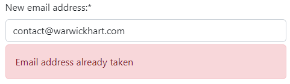

# SERVER DIRECTORY WEBSITE

## Gamer's-verse

## Full stack website

**Built using**:\
Django, Python, JavaScript, BootStrap, CSS and HTML.

**Also including**:\
Cloudinary, SELECT2 and tinyMCE.

## Live Site

[Hosted on Herokuapp](https://server-directory-website.herokuapp.com/)

## Repository

[GitHub repository](https://github.com/BobWritesCode/server-directory-website)

---

## Table of Contents

- [Gamer's-verse](#Gamer's-verse)
  - [Live Site](#live-site)
  - [Repository](#repository)
  - [Table of Contents](#table-of-contents)
  - [Objective](#objective)
  - [Brief](#brief)
    - [Gamer's-verse - Server Directory Website](#gamer's-verse-server-directory-website)
  - [UX &#8722; User Experience Design](#ux--user-experience-design)
    - [Site-visitor](#site-visitor)
    - [Server-Owner](#server-owner)
    - [Site Admin](#site-admin)
  - [Development](#initial-concept)
    - [Wireframes](#wireframes)
    - [Colour Scheme](#colour-scheme)
    - [Typography](#typography)
    - [Imagery](#imagery)
  - [Logic](#logic)
    - [Data Model](#data-model)
    - [Python](#python)
    - [JavaScript](#javascript)
  - [Features](#features)
    - [Existing Features](#existing-features)
    - [Features Left to Implement](#features-left-to-implement)
  - [Data Model](#data-model)
  - [Technologies Used](#technologies-used)
    - [Python Packages](#python-packages)
    - [VS Code Extensions](#vs-code-extensions)
    - [Other Tech](#other-tech)
  - [Testing](#testing)
    - [Extensive Testing](#extensive-testing)
    - [Testers](#testers)
    - [Python](#python)
    - [JavaScript](#javascript)
  - [Bugs](#bugs)
    - [Current](#current)
    - [Resolved](#resolved)
  - [Development](#development)
    - [GitHub - Create new repository from template](#github---create-new-repository-from-template)
    - [GitHub - Cloning](#github---cloning)
    - [Cloudinary](#cloudinary)
    - [Postgres](#postgres)
    - [Heroku](#heroku)
  - [Credits](#credits)
    - [Content](#content)
    - [Media](#media)
    - [Acknowledgements](#acknowledgements)

---

## Objective

Design a Full-Stack site based on business logic used to control a centrally-owned dataset. I will need to set up an authentication mechanism and provide role-based access to the site's data or other activities based on the dataset.

**Main Technologies that need to be used**:\
HTML, CSS, JavaScript, Python+Django
Relational database (recommending MySQL or Postgres)

## Brief

### Gamer's-verse - Server Directory Website

The goal of this website are:

- to provide a private server directory that users can visit to find a private server based on the game they wish to find that server on.
- for server owners to be able to list their own server to be found by potential players.
- to have a front-end admin access section that allows "staff" to moderate listings. As well as manage users, listings, games and tags.

---

## UX &#8722; User Experience Design

Some example user stories which will affect the design and project functionality.

### Site-visitor

> *"As a site user there is a easy to navigate homepage so that I can get to the correct part of the website without confusion."*
>
> *"As a new site user I can sign up so that access member only features like creating a server listing."*
>
> *"As a site-user I can login so that access my profile and make changes."*
>
> *"As a site-user I can choose a game from list of games on the homepage so that I can see all the private servers available for that game."*
>
> *"As a site-user I want the server list to show only servers for the game I selected on the homepage so that I don't get confused with servers appearing from games I did not select."*
>
> *"As a site-user I can click on a server in the server list so that I can see full details of that server in a new page."*
>
> *"As a site user I can like a server so that other users can see what servers receive positive feedback."*
>
> *"As a site user I can filter my search results so that I can narrow down my choices to be more specific."*
>
> *"As a site user I can filter my search results so that I can narrow down my choices to be more specific."*
>
> *"As a site user I can search the directory so that I can see a list of server that may interest me."*
>

### Server-Owner

> *"As a server owner I can list my server in the directory so that potential new players will be able to find my server."*
>
> *"As a server owner I can delete my server listening so that it is no longer available to republished."*
>
> *"As a server owner I can update my server listening so that I can make sure that the latest information is available all the time."*
>
> *"As a server owner I can apply tags so that site users can more easily can my server that may interest them."*
>
> *"As a server owner I can upload images for my server profile so that site users can get a better feel for my server."*

### Site Admin

> *"As a site admin I can manually feature a listening so that they get extra awareness."*
>
> *"As a site admin I want to be able to manage the site from a user-friendly admin panel."*

---

## Development

### Wireframes

Below are some wireframe that I designed to help build and represent the design of the website.

#### Homepage design

<details><summary>PC</summary>


</details>
<details><summary>Mobile</summary>


</details>

#### Listings design

<details><summary>PC</summary>


</details>
<details><summary>Mobile</summary>


</details>

#### Full listing design

<details><summary>PC</summary>


</details>
<details><summary>Mobile</summary>


</details>

#### My Account design

<details><summary>PC</summary>


</details>
<details><summary>Mobile</summary>


</details>

#### Create Listing design

<details><summary>PC</summary>


</details>
<details><summary>Mobile</summary>


</details>

### Colour Scheme

The 4 main colour's hex codes for this site are: D63600, F8F9FA, 262626, 151515.\
This 4 colours contrast very nicely against each other, and the white text against the other 3 colours pass WCAG contrast scores.


### Typography

### Imagery

---

## Logic

### Data Model

The below entity relationship diagram (ERD) is a graphical representation that depicts relationships between the different models in this project. It also shows the different attributes and their types for each class.


*Created using: [app.diagrams.net](https://app.diagrams.net)*

### Python

### JavaScript

---

## Features

### Existing Features

#### Navbar

The navbar was design to be simple and vibrant. Early versions the Navbar was off-white but feedback suggested that it was not completely obvious there was a nav bar as it would tend to merge in with the browser bar if using a PC to access the website.

Depending if the user is flagged as a staff member will determine if they can see the 'Admin' nav button.

<details><summary>PC</summary>


</details>

<details><summary>Mobile</summary>


</details>

```html
<!-- base.html -->
<div class="collapse navbar-collapse" style="flex-grow: unset;" id="navbarTogglerDemo02">
    <ul class="navbar-nav mt-2 mt-lg-0">
        <!-- Here we check to see if the requesting user is logged in -->
        
        <li class="navbar-text text-light">
            <strong>Hi {{ user.username }}!</strong>
        </li>
        <li class="nav-item">
            <a class="nav-link text-light" href="">My Account</a>
        </li>
        <!-- Here we check to see if the requesting user is a staff member -->
        
        <li class="nav-item text-light">
            <a class="nav-link text-light" href="">Admin</a>
        </li>
        
        <li class="nav-item text-light">
            <a class="ms-1 me-3 btn btn-outline-light" href="">Log Out</a>
        </li>
        <!-- If requesting user is not logged in -->
        
        <li class="nav-item">
            <a class="ms-1 nav-link text-light" href="">Login</a>
        </li>
        <li class="nav-item">
            <a class="ms-1 me-3 btn btn-outline-light" href="">Sign Up</a>
        </li>
        
    </ul>
</div>
```

#### Homepage

The homepage is designed to be simple and provide a clear understanding of what the website is about when a first time user visits.

<details><summary>Homepage screenshot</summary>


</details>

The user can hover their mouse over the different game cards. This help the user understand these are intractable. For UX purpose the whole card was made a clickable link to avoid user confusion on how to proceed.


#### Server listings

The server listing page allows the user to start looking through the different listings. The user can filter their search down using the tags filter on the right. They can select up to as many tags as they like and also easily remove tags. This provides a much more bespoke list that is filled only with that user's interests.

<details><summary>Server listings screenshot</summary>


</details>

```python
# views.py
# These are snippets from the code to provide the filtering by essentially
# building tag string in the url. I removed other parts of this method not
# to the tag filtering.

def server_listings(request: object, slug: str, tag_string: str = ""):

    # Get only the tags linked to a game.
    game = get_object_or_404(Game, slug=slug)
    tags = game.tags.all()

    # Create and empty list then append all tags into that list.
    all_tags_for_game = []
    for tag in tags:
        all_tags_for_game.append([tag.pk, tag.name])

    # Manage tag_string
    if tag_string != "":
        # Create list from string
        selected_tags = tag_string.split("%")
        # Check to see if adding or removing tag
        action = selected_tags.pop(0)

        # A = add tag, R = remove tag
        if action == "A":
            # Prepare new tag_string to send to front-end
            tag_string = '%' + '%'.join(selected_tags)

        else:
            # Which tag has been selected to be removed
            to_be_removed = selected_tags.pop(0)

            # Remove tag from selected list
            selected_tags.remove(to_be_removed)

            # Check to see if all tags have been unselected
            # Prepare tag_string
            if len(selected_tags) != 0:
                tag_string = '%' + '%'.join(selected_tags)
            else:
                tag_string = ''

        # Narrows server list down based on tags picked by user
        for value in selected_tags:
            listings = listings.filter(tags__name=value)

        # Use list comprehension to remove selected tags from all
        # available tags
        tags = [x for x in game.tags.all() if x.name not in selected_tags]

        tags.sort(key=operator.attrgetter('name'))
        selected_tags.sort()

    else:
        # If tag_string empty then create empty list
        selected_tags = []
        # Get all available tags for game selected
        tags = game.tags.all().order_by('name')

    # We can now render the page and provide tags, selected_tags and
    # tag_string as context.
```

#### Server detailed page

<details><summary>Screenshot</summary>


</details>

The full listing page provides the user a much more detailed insight about the server listing. It allows the server owner to provide a long description so they can describe as much detail as they want about the server to attract new players.

On this page their is a section just under the tags where a user can interact with, here a user can:

- Bump the listing,
- Find the discord invite link,
- Find the TikTok profile link (if available, if not this button will not be shown).

If the user is a staff member then the staff view panel will also be shown, where a staff user can quickly go to the owner's profile or edit the listing.


#### Bumps


Bumps allow user to help promote a listing. Bumping a server will push it to the top of the listings. And similar to how search engine results work, the higher up the list you are the more views you will get.

To help promote active servers bumps expire after the duration set by the site owner, currently stored in the `constants.py` file, but at a later date there will be an option to be able to change this in a super admin panel. Making it easier for an end user to update themselves.

A user can only bump up to a specific amount of listings at a time, and will have to wait until their bump expires. Currently it is set to expire the next date for the purposes of this project demonstration.

A user can only bump a single list once at a time.
Once a user has used up their allocated bumps they will see a message saying they are out of bumps.
A user has to be signed in to bump otherwise they will see a message saying they need to login first.

 

This is what the user Bumps list looks like in their 'My Account' page.


The way the bumps are automatically expired is by setting a automated task that run at midnight everyday or at server restart. The task will query for bumps that are less than or, equal to the current date and delete them. Print messages are produced purely as a way to check there are no issues.

*You can read more about how the automated jobs work by checking out the APScheduler section of this README.*

```python
#jobs.py
def clear_bumps():
    """
    Automated task: Finds expired bumps and deletes them.
    """
    print('clear_bumps(): Starting automated task.')
    # Get bumps that have expired
    # __lte means 'less than or, equal to', this is used oppose to '<='>
    query = Q(expiry__lte=datetime.now())
    queryset = Bumps.objects.filter(query)
    print(f'clear_bumps(): Deleting {len(queryset)} bump(s).')
    # Delete expired bumps
    queryset.delete()
    print('clear_bumps(): Completed automated task.')
```

#### User Authentication

##### Sign up

<details><summary>Screenshot</summary>


</details>

It's important that user's can easily sign up, the sign up form it self is designed to be simplistic. Asking for a username, email address, and password. Email and password will be what is required to login but the username will be used to identify the user to other site users and staff. Both the username and email address have to be unique and the user will be notified if they are not.


```python
# views.py
def sign_up_view(request):
    """
    Loads sign up view.

    Args:
        request (object): GET/POST request from user.

    Returns:
        redirect (function): Email verification view.
        render (function): Loads view.
    """
    if request.method == 'POST':
        form = SignupForm(request.POST)
        # Check user has completed form as required.
        if form.is_valid():
            # Save new user to database.
            user.save()
            send_email_verification(request, user)
            return redirect('signup_verify_email')
    else:
        form = SignupForm()
    return render(request, 'registration/signup.html', {'form': form})
```

##### Email verification

Once the user has successfully input the their sign up details they will be directed to a screen explaining that they have been sent an email to verify their email address.

<details><summary>Screenshot</summary>


</details>

```python
# views.py
def send_email_verification(request: object, user: object):
    '''
    Send email address verification to user.

    Parameters:
        request (object): GET/POST request from user.
        user (object): Target user model object.
    '''
    current_site = get_current_site(request)
    mail_subject = 'Verify your email address.'
    message = render_to_string('email_templates/verify_email_address.html', {
        'user': user,
        'domain': current_site.domain,
        'uid': urlsafe_base64_encode(force_bytes(user.pk)),
        'token': default_token_generator.make_token(user),
    })

    # Send email to user.
    send_mail(
        subject=mail_subject,
        message=message,
        from_email='contact@warwickhart.com',
        recipient_list=[user.email]
    )
```

To make sure your emails send you need to make sure you set up the following settings correctly in your settings.py

```python
# settings.py
EMAIL_BACKEND = 'django.core.mail.backends.smtp.EmailBackend'
MAILER_EMAIL_BACKEND = EMAIL_BACKEND
EMAIL_HOST = os.environ.get('EMAIL_HOST')
EMAIL_PORT = os.environ.get('EMAIL_PORT')
EMAIL_USE_SSL = True
EMAIL_HOST_USER = os.environ.get('EMAIL_HOST_USER')
EMAIL_HOST_PASSWORD = os.environ.get('EMAIL_HOST_PASSWORD')
```

The user will receive a email notification, you can personalise the email using a template. This is a very basic template but for the purpose of this project serves the projects need's.

```html

Hi {{ user.username }},

Please click on the link to confirm your registration,

http://{{ domain }}

If you think, it's not you, then just ignore this email.

Kind regards
The Gamer's-verse team


```


Once the user visits the link in the email they will be taken to the page to show that their email address is now verified and they can now login.

<details><summary>Screenshot</summary>


</details>

##### Login

<details><summary>Screenshot</summary>


</details>

The login screen as many of us would expect is a nice simple user form to input their email address and password.

If the user cannot be found, or password does not match the correct account they will get a notification them so.


Also if the user has been flagged as banned they will also get told so.


Once user has been authenticated they will then be redirected to their 'My Account' page.

```python
# views.py
def login_view(request: object):
    """
    Login-view and process login.

    Args:
        request (object): GET/POST request from user..

    Returns:
        render(): Loads html page.
    """
    error_message = None

    # If user already logged in, just direct them to My Account page.
    if request.user:
        return redirect("my-account")

    if request.method == 'POST':
        # Get from request user input.
        email = request.POST['email']
        password = request.POST['password']
        # Check credentials are found and a match.
        user = authenticate(request, email=email, password=password)
        if user is None:
            # ERROR: User not found, or password mismatch.
            error_message = (
                "Either user does not exist or password does not "
                "match account."
            )
        else:
            # Check if user is banned.
            if user.is_banned:
                # ERROR: User account has been flagged as banned.
                error_message = "This account is banned."
                user = None
            # All being okay, log user in.
            else:
                login(request, user)
                return redirect("my-account")

    form = LoginForm()

    return render(
        request,
        "registration/login.html",
        {
            "form": form,
            "error_message": error_message,
        },
    )
```

##### Forgotten password

<details><summary>Screenshot</summary>


</details>

At some point a user will forget their password. So I have made sure included within the project is a forgotten password function.

Taking advantage of the Django auth_views class, we can do this with relative ease, assuming that emailing has beet set up

The use will see a password reset confirmation page, to let them know that request has been accepted.

<details><summary>Screenshot</summary>


</details>

The user will then receive an email with a link to reset their password.


After the user visits the link they will be directed to the "Enter new password" page.

<details><summary>Screenshot</summary>


</details>

And finally once the user has confirmed their new password, they are presented with the option to login or go to the homepage.

<details><summary>Screenshot</summary>


</details>

```python
# urls.py

path(
    'accounts/password_reset',
    auth_views.PasswordResetView.as_view(
        template_name="registration/password_reset_form.html",
        form_class=PasswordResetForm,
        subject_template_name='email_templates/password_reset_subject.txt',
        email_template_name='email_templates/password_reset_email.html',
        success_url='password_reset_done',
    ),
    name='password_reset'
),

path(
    'accounts/password_reset_done',
    auth_views.PasswordResetDoneView.as_view(
    ),
    name='password_reset_done'
),

path(
    'accounts/password_change/',
    auth_views.PasswordChangeView.as_view(
        template_name="registration/password_change_form.html",
        success_url='password_change_done',
        form_class=PasswordChangeForm,
        extra_context={},
    ),
    name='password_change'
),

path(
    'accounts/reset/<uidb64>/<token>/',
    auth_views.PasswordResetConfirmView.as_view(
        template_name="registration/password_reset_confirm.html",
        success_url='password_reset_complete',
        form_class=SetPasswordForm,
        extra_context={},
    ),
    name='password_reset_confirm'
),
```

#### My Account

<details><summary>Screenshot</summary>


</details>

The 'My Account' is the main hub for a user to mange their profile, see their active bumps, create and manage their listings, and delete their account.

##### Profile

Starting from the top of the 'My Account' page and working our way down, the first section is the 'Profile' section. In this section the user can see their username and their current email address. Currently the user cannot update their username but this is something that could be available in a future update.

##### Email update

By clicking on the Update email address button the user will see a modal come up with instructions on how to change their email address.


If the user tries to change their email address to an email address already in use, they will receive an error notification.



Once the form is completed the user's email address will be updated but the the email address will now be unverified. The user will also be sent an email to verify their new email address just like they did when they originally signed up to the website.


##### Password change

<details><summary>Screenshot</summary>


</details>

Takes you to the password change page where the user is required to enter their current password, and then their new password twice.

<details><summary>Screenshot</summary>


</details>

All going well, the user will be shown a password change page to confirm the change was successful.

##### Delete account

##### My Listings

Management panel

### Admin Account Page

### Image Approval

### Manage Users

#### Updating user

#### Banning user

#### Send user verification email

#### Assign/Resign as staff

#### Delete user

#### See user listings

### Manage Games

#### Adding a game

#### Updating a game

### Manage Tags

#### Adding a tag

#### Updating a tag

---

#### Select2

[Select2](https://select2.org/)

#### tinyMCE

[tinyMCE](https://django-tinymce.readthedocs.io/en/latest/)

### Sending email verification

To help me get this set up, I followed this [guide](https://shafikshaon.medium.com/user-registration-with-email-verification-in-django-8aeff5ce498d).

There were some changes to be made due to potentially using newer version of Django.

Instead of using `EmailMessage()`, I used `send_mail()`.

```python
# ORIGINAL CODE
email = EmailMessage(
    subject=mail_subject,
    body=message,
    to=[to_email]
)
email.send()
```

```python
# NEW CODE
send_mail(
    subject=mail_subject,
    message=message,
    from_email='contact@warwickhart.com',
    recipient_list=[to_email]
)
```

### Features Left to Implement

---

## Technologies Used

### Python Packages

#### datetime

pip install datetime

#### django-apscheduler

pip install django-apscheduler

### VS Code Extensions

### Other Tech

---

## Testing

### Extensive Testing

### Testers

### Python

### JavaScript

---

## Bugs

### Current

### Resolved

---

## Development

### GitHub - Create new repository from template

### GitHub - Cloning

### Cloudinary

### Postgres

### Heroku

---

## Credits

### Content

### Media

### Acknowledgements
